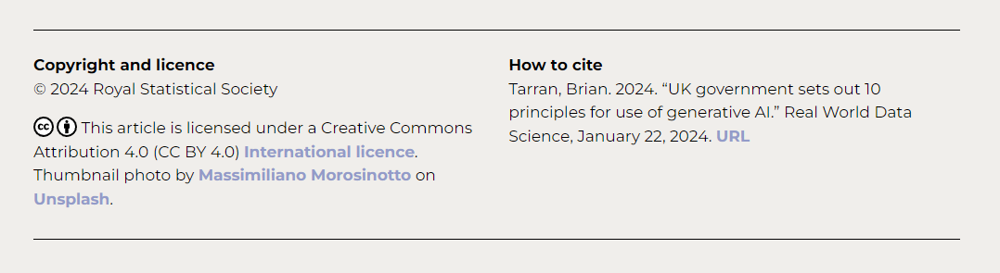

## Content
The website [realworlddatascience.net](https://realworlddatascience.net/) ("the website") and the "Real World Data Science" and "RWDS" brands and logos are copyright &copy; Royal Statistical Society.

Copyright and licence terms for published articles and any associated videos, images, or other material can be found at the end of each article page, e.g.:

We make every reasonable effort to locate, contact and acknowledge copyright owners and wish to be informed by any copyright owners who are not properly identified and acknowledged so that we may make any necessary corrections.

Where licence terms for individual articles, videos, images and other published content permit republication, you may do so in accordance with the stated terms of the respective licence(s).

You are not permitted to republish the website in its entirety.

## Software and services
Source code and files for the website are available from [GitHub](https://github.com/realworlddatascience/realworlddatascience.github.io). Use of our GitHub repository is governed by the [Contributor Covenant Code of Conduct](/CODE_OF_CONDUCT.md). 

The website is built using [Quarto](https://quarto.org/), an open-source scientific and technical publishing system developed by [Posit](https://posit.co/). Quarto source code and software licences are available from [GitHub](https://github.com/quarto-dev).

Real World Data Science is hosted by [GitHub Pages](https://pages.github.com/). 

The website uses [Google Analytics 4](https://support.google.com/analytics/answer/10089681?hl=en) for web analytics reporting.

Fonts used on Real World Data Science are served by the Google Fonts API. This is to improve site loading speeds and font compatibility across devices. Review the [Google Fonts Privacy and Data Collection statement](https://developers.google.com/fonts/faq/privacy).

User comments and reaction functionality is provided by [giscus](https://giscus.app/), a comments system powered by [GitHub Discussions](https://docs.github.com/en/discussions). Use of this comment functionality is governed by the [Contributor Covenant Code of Conduct](/CODE_OF_CONDUCT.md).