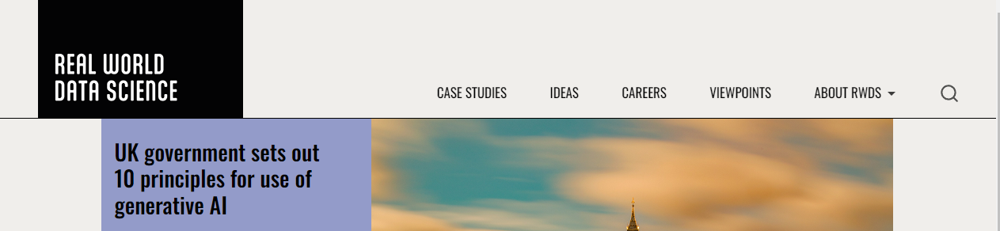
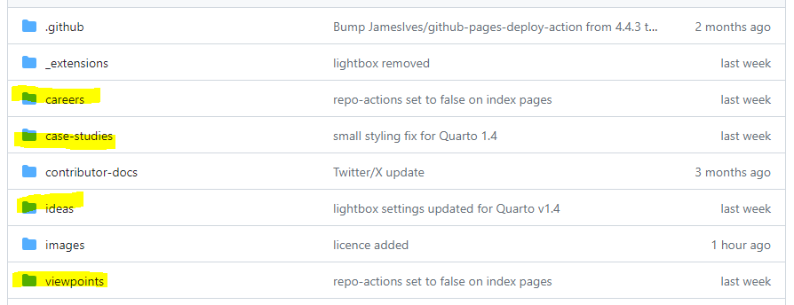
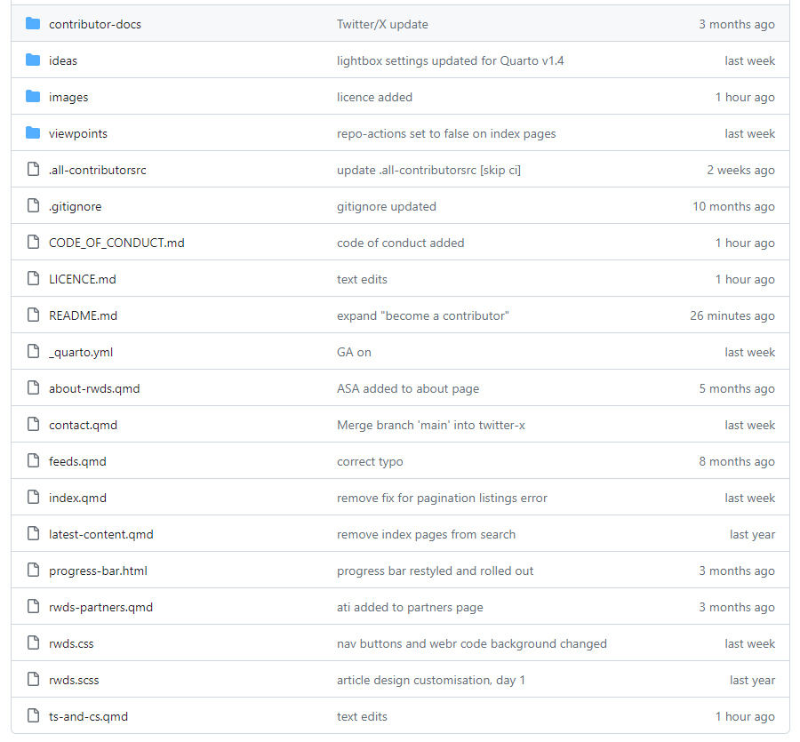
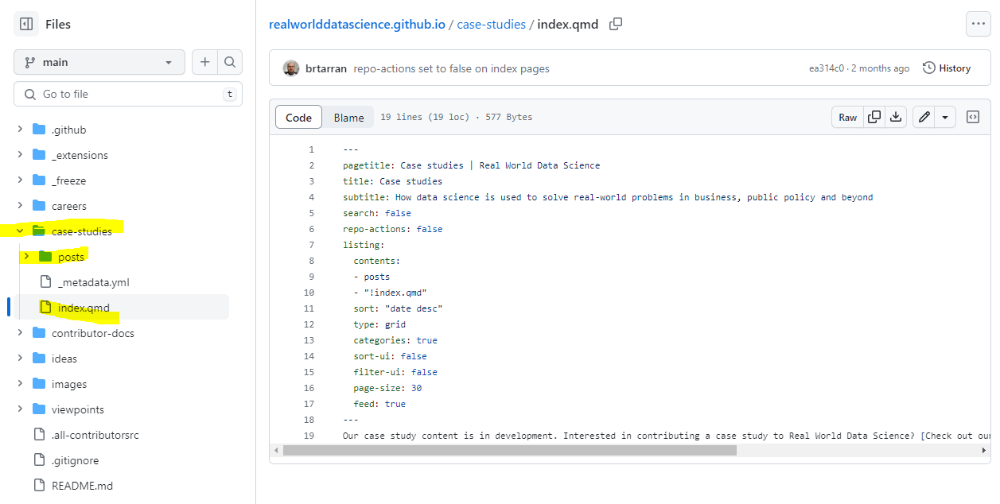
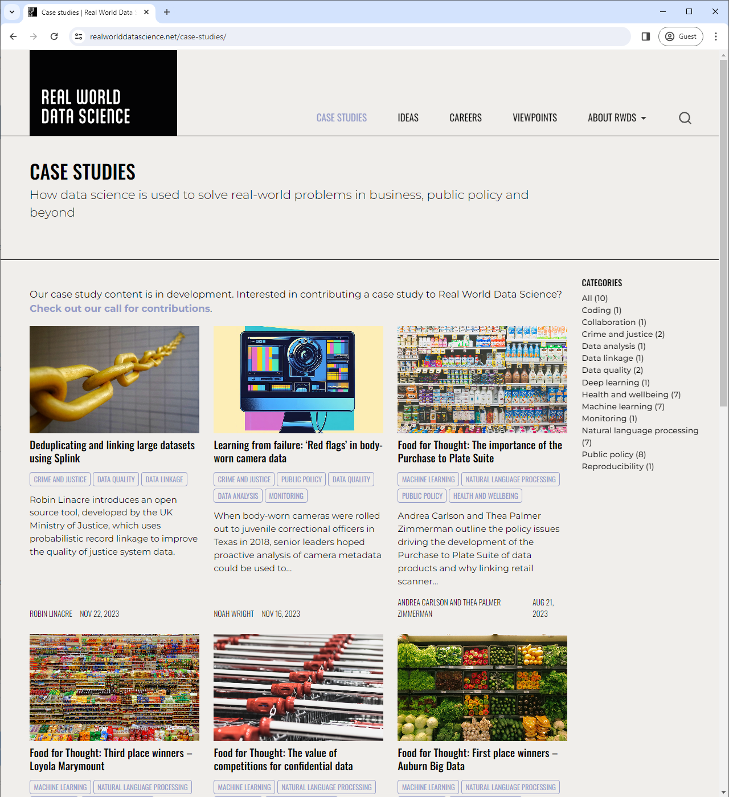
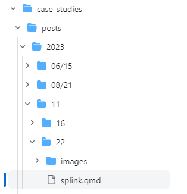
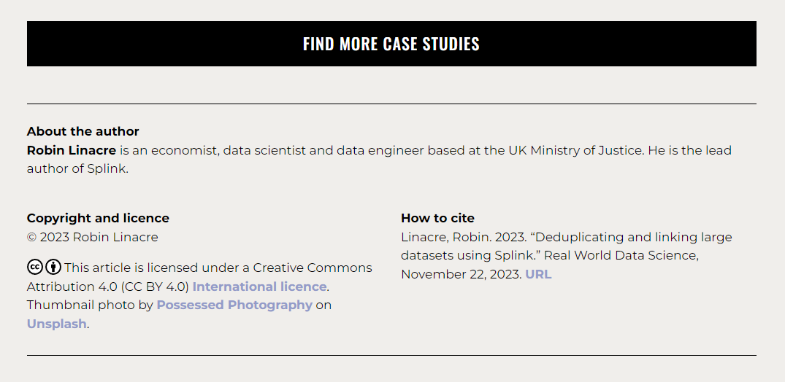
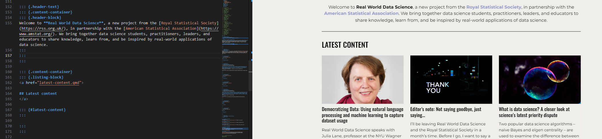
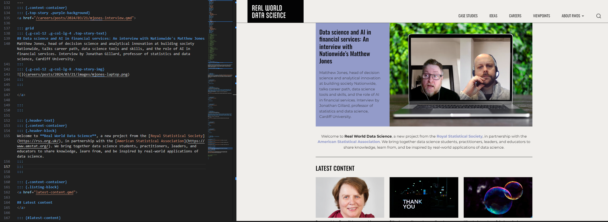
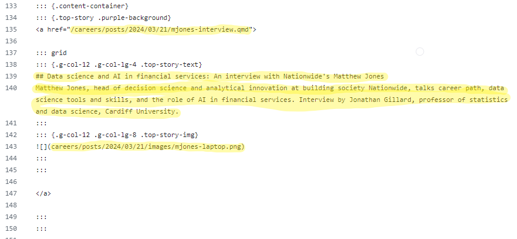

# Real World Data Science: <br/> Data science and AI in action

Welcome to the home of [Real World Data Science](https://realworlddatascience.net/), a new project from the [Royal Statistical Society](https://rss.org.uk/), in partnership with the [American Statistical Association](https://www.amstat.org/). This repository contains all the source files and code for our website. 

The site and its content are being created and curated by data science practitioners and leaders with a single goal in mind: to help you deliver high quality, ethical, impactful data science and AI in your workplace.

## Table of contents
1. [Contributors](#contributors-)
2. [Become a contributor](#become-a-contributor)
3. [Site and repository structure](#site-and-repository-structure)
4. [Create an article](#create-an-article)
5. [Add an article](#add-an-article)
6. [Update the homepage](#update-the-homepage)
7. [Publish an article](#publish-an-article)

## Contributors ✨
<!-- ALL-CONTRIBUTORS-BADGE:START - Do not remove or modify this section -->
[](#contributors)
<!-- ALL-CONTRIBUTORS-BADGE:END -->

Our thanks go to these wonderful people for all their contributions to [Real World Data Science](https://realworlddatascience.net/) -- writing articles, developing tutorials, expanding our documentation, creating resources to support other contributors, raising issues, and squishing bugs, among other things ([emoji key](https://allcontributors.org/docs/en/emoji-key)):

<!-- ALL-CONTRIBUTORS-LIST:START - Do not remove or modify this section -->
<!-- prettier-ignore-start -->
<!-- markdownlint-disable -->
<table>
  <tbody>
    <tr>
      <td align="center" valign="top" width="14.28%"><a href="https://github.com/asbudhkar"><br /><sub><b>Aishwarya Budhkar</b></sub></a><br /><a href="#content-Asbudhkar" title="Content">🖋</a></td>
      <td align="center" valign="top" width="14.28%"><a href="http://alex.knipper.ml"><br /><sub><b>Alex Knipper</b></sub></a><br /><a href="#content-alexknipper" title="Content">🖋</a></td>
      <td align="center" valign="top" width="14.28%"><a href="https://github.com/andrepython"><br /><sub><b>Andre Python</b></sub></a><br /><a href="#content-andrepython" title="Content">🖋</a></td>
      <td align="center" valign="top" width="14.28%"><a href="https://andrew-saydjari.github.io/"><br /><sub><b>Andrew Saydjari</b></sub></a><br /><a href="#content-andrew-saydjari" title="Content">🖋</a></td>
      <td align="center" valign="top" width="14.28%"><a href="https://symbolica.io"><br /><sub><b>Ben Ruijl</b></sub></a><br /><a href="https://github.com/realworlddatascience/realworlddatascience.github.io/commits?author=benruijl" title="Code">💻</a></td>
      <td align="center" valign="top" width="14.28%"><a href="http://coleridgeinitiative.org"><br /><sub><b>Coleridge Initiative</b></sub></a><br /><a href="#content-Coleridge-Initiative" title="Content">🖋</a></td>
      <td align="center" valign="top" width="14.28%"><a href="https://www.dkepplinger.org"><br /><sub><b>David Kepplinger</b></sub></a><br /><a href="#content-dakep" title="Content">🖋</a></td>
    </tr>
    <tr>
      <td align="center" valign="top" width="14.28%"><a href="https://github.com/dsvanidze"><br /><sub><b>Davit Svanidze</b></sub></a><br /><a href="#content-dsvanidze" title="Content">🖋</a></td>
      <td align="center" valign="top" width="14.28%"><a href="https://www.ds-econ.com/"><br /><sub><b>Finn-Ole Höner</b></sub></a><br /><a href="https://github.com/realworlddatascience/realworlddatascience.github.io/commits?author=finnoh" title="Code">💻</a> <a href="https://github.com/realworlddatascience/realworlddatascience.github.io/commits?author=finnoh" title="Documentation">📖</a> <a href="https://github.com/realworlddatascience/realworlddatascience.github.io/pulls?q=is%3Apr+reviewed-by%3Afinnoh" title="Reviewed Pull Requests">👀</a></td>
      <td align="center" valign="top" width="14.28%"><a href="https://github.com/holliejohnson"><br /><sub><b>Hollie</b></sub></a><br /><a href="#ideas-holliejohnson" title="Ideas, Planning, & Feedback">🤔</a></td>
      <td align="center" valign="top" width="14.28%"><a href="http://jauerbach.github.io"><br /><sub><b>Jonathan Auerbach</b></sub></a><br /><a href="#content-jauerbach" title="Content">🖋</a> <a href="https://github.com/realworlddatascience/realworlddatascience.github.io/pulls?q=is%3Apr+reviewed-by%3Ajauerbach" title="Reviewed Pull Requests">👀</a></td>
      <td align="center" valign="top" width="14.28%"><a href="http://liambrierley.wordpress.com"><br /><sub><b>Liam Brierley</b></sub></a><br /><a href="#content-lbrierley" title="Content">🖋</a></td>
      <td align="center" valign="top" width="14.28%"><a href="https://faculty.bentley.edu/profile/mbhaduri"><br /><sub><b>Moinak Bhaduri</b></sub></a><br /><a href="#content-moinakbhaduri" title="Content">🖋</a></td>
      <td align="center" valign="top" width="14.28%"><a href="https://bnaman50.github.io/"><br /><sub><b>Naman Bansal</b></sub></a><br /><a href="#content-bnaman50" title="Content">🖋</a></td>
    </tr>
    <tr>
      <td align="center" valign="top" width="14.28%"><a href="https://nrennie.rbind.io/"><br /><sub><b>Nicola Rennie</b></sub></a><br /><a href="#content-nrennie" title="Content">🖋</a> <a href="https://github.com/realworlddatascience/realworlddatascience.github.io/pulls?q=is%3Apr+reviewed-by%3Anrennie" title="Reviewed Pull Requests">👀</a></td>
      <td align="center" valign="top" width="14.28%"><a href="https://github.com/enndubbs"><br /><sub><b>Noah DeGrange</b></sub></a><br /><a href="#content-enndubbs" title="Content">🖋</a> <a href="https://github.com/realworlddatascience/realworlddatascience.github.io/pulls?q=is%3Apr+reviewed-by%3Aenndubbs" title="Reviewed Pull Requests">👀</a></td>
      <td align="center" valign="top" width="14.28%"><a href="https://www.robinlinacre.com"><br /><sub><b>Robin Linacre</b></sub></a><br /><a href="#content-RobinL" title="Content">🖋</a></td>
      <td align="center" valign="top" width="14.28%"><a href="https://github.com/WenyingEcon"><br /><sub><b>WenyingEcon</b></sub></a><br /><a href="#content-WenyingEcon" title="Content">🖋</a></td>
      <td align="center" valign="top" width="14.28%"><a href="https://github.com/YANGWU001"><br /><sub><b>Yang</b></sub></a><br /><a href="#content-YANGWU001" title="Content">🖋</a></td>
      <td align="center" valign="top" width="14.28%"><a href="https://github.com/JasonZhangzy1757"><br /><sub><b>Zheyuan (Jason) Zhang</b></sub></a><br /><a href="#content-JasonZhangzy1757" title="Content">🖋</a> <a href="https://github.com/realworlddatascience/realworlddatascience.github.io/pulls?q=is%3Apr+reviewed-by%3AJasonZhangzy1757" title="Reviewed Pull Requests">👀</a></td>
      <td align="center" valign="top" width="14.28%"><a href="https://philosopher-analyst.netlify.app/"><br /><sub><b>Zoë Turner</b></sub></a><br /><a href="https://github.com/realworlddatascience/realworlddatascience.github.io/issues?q=author%3ALextuga007" title="Bug reports">🐛</a></td>
    </tr>
    <tr>
      <td align="center" valign="top" width="14.28%"><a href="https://github.com/Isabelsassoon"><br /><sub><b>isabelsassoon</b></sub></a><br /><a href="#content-isabelsassoon" title="Content">🖋</a> <a href="#ideas-isabelsassoon" title="Ideas, Planning, & Feedback">🤔</a></td>
      <td align="center" valign="top" width="14.28%"><a href="https://github.com/karmake2"><br /><sub><b>karmake2</b></sub></a><br /><a href="#content-karmake2" title="Content">🖋</a></td>
      <td align="center" valign="top" width="14.28%"><a href="https://github.com/mkorpusik"><br /><sub><b>mkorpusik</b></sub></a><br /><a href="#content-mkorpusik" title="Content">🖋</a></td>
      <td align="center" valign="top" width="14.28%"><a href="https://github.com/nrios4"><br /><sub><b>nrios4</b></sub></a><br /><a href="#content-nrios4" title="Content">🖋</a></td>
      <td align="center" valign="top" width="14.28%"><a href="https://github.com/psresnik"><br /><sub><b>psresnik</b></sub></a><br /><a href="#content-psresnik" title="Content">🖋</a></td>
    </tr>
  </tbody>
</table>

<!-- markdownlint-restore -->
<!-- prettier-ignore-end -->

<!-- ALL-CONTRIBUTORS-LIST:END -->

This project follows the [all-contributors](https://github.com/all-contributors/all-contributors) specification. Contributions of any kind welcome!

## Become a contributor
[Real World Data Science](https://realworlddatascience.net/) aims to inform, inspire and strengthen the data science community by showcasing real-world examples of data science practice and bringing together data scientists to share knowledge.

We cannot succeed in these aims without the support and contributions of the data science community, so we invite you to review our [open call for contributions](https://realworlddatascience.net/contributor-docs/call-for-contributions.html).

The call for contributions links to detailed notes for the various types of content we are looking to publish, including case studies and tutorials. It describes the website's basic functionality, our ethos, the submission and review process, and what happens post-publication. There's also a style guide with advice on tone and structure, and ways of handling technical content, jargon, figures and more.

While the call for contributions focuses primarily on site content, we also welcome contributions that seek to improve the design and functionality of the site itself. [Real World Data Science](https://realworlddatascience.net/) is built using [Quarto](https://quarto.org/), an open-source scientific and technical publishing system developed by [Posit](https://posit.co/). [We learned a lot from the open-source community in building this site](https://www.youtube.com/watch?v=ncDEqHxMWnE), and we hope we can return the favour in time by expanding the scope of what's possible to build with Quarto.  

## Site and repository structure

### Overview

[Real World Data Science](https://realworlddatascience.net/) consists of a homepage, 4 main content sections, and a small collection of documents that introduce the site, its aims, our partners and so on. This structure is reflected in our navigation bar:



Here you can see our four main content sections:

- Case studies
- Ideas
- Careers
- Viewpoints

And then there is the "About RWDS" section, which links to those documents containing general information about the site.

Our repository structure mirrors the site structure. We have folders for each of our main content sections, highlighted in yellow below:



There is no dedicated folder for the "About RWDS" section. Instead, these documents all reside in the root of the repository. The exceptions are the documents related to our [call for contributions](https://realworlddatascience.net/contributor-docs/call-for-contributions.html), which are grouped together in the "contributor-docs" folder.



As you'll see from the above image, all documents/article files are in the `.qmd` format. These are Quarto's own version of [Markdown documents](https://www.markdownguide.org/) which can be rendered and output as different filetypes. For RWDS, our `.qmd` files are output as html pages, but Quarto can also produce Word documents and PDFs from the same source file. We'll discuss the `.qmd` format in more detail in the [Create an article](#create-an-article) section. For now special mention needs to be made to the `index.qmd` file. You will see this file name frequently throughout our repo, and each `index.qmd` file controls a homepage -- either the main site homepage or a section homepage.

Other file types in the root of the repository are:

- `.all-contributorsrc` -- contains the data that populates our [contributor list](#contributors-)
- `.gitignore` -- a list of files or folders that are excluded from version control
- `.md` -- content files that are published only as part of the RWDS repository, not as part of the site itself (this README, for example)
- `progress-bar.html` -- code that is used across the site to apply a progress bar to published articles
- `.css` and `.scss` -- files controlling site design and styling

The most important file for understanding and controlling site structure is `_quarto.yml`. From here we set the appearance of the navigation bar and the content it links to; page navigation for sections and sub-sections; the site footer; and basic formatting. 

> Extensive documentation on all aspects of the `_quarto.yml` is available on the [Quarto website](https://quarto.org/docs/websites/).

### Index files and listings
`index.qmd` files appear throughout the RWDS repo and, as explained earlier, the content of these files determines what appears on our homepages -- either the main site homepage or section homepages.

To understand these file types and pages in a bit more detail, it's best to think of each RWDS homepage as, essentially, a page of listings: the main site homepage contains listings of articles from all the different sections of the site, whereas section homepages list only articles that appear in their respective sections.

To explain, let's take a look at a straightforward example: the `index.qmd` file for the Case Studies section:



And here's a clearer view of the code:

``` yaml
---
pagetitle: Case studies | Real World Data Science
title: Case studies
subtitle: How data science is used to solve real-world problems in business, public policy and beyond
search: false
repo-actions: false
listing:
  contents: 
  - posts
  - "!index.qmd"
  sort: "date desc"
  type: grid
  categories: true
  sort-ui: false
  filter-ui: false
  page-size: 30
  feed: true
---
Our case study content is in development. Interested in contributing a case study to Real World Data Science? [Check out our call for contributions](/contributor-docs/call-for-contributions.qmd). 
```

This is just 19 lines of code, and 18 of them are the YAML configuration for the page. If we  look at a screenshot of the homepage, we can then explore what each line of code is doing on the published page:



`pagetitle` controls what appears in the browser tab header, `title` and `subtitle` are the page header contents, `search: false` and `repo-actions: false` switch off functionality that is not needed specifically for this page, and the `listing:` section determines what `contents` are listed on the page. Here, we define the `contents` as being any `.qmd` files that reside within the `posts` subfolder of the Case Studies folder, but we specifically exclude any `index.qmd` files from appearing in the listings by prefixing the filename with a `!`.

As we move further down the `listing` section of the YAML, we set the `sort` order our contents appear in, what layout `type` to use, whether article `categories` should appear as part of the listings page, and whether users should have the ability to reorder and filter content using the `sort-ui` and `filter-ui` options. Finally, we set the number of listed items per page using the `page-size` variable, while `feed: true` creates [an XML file](https://realworlddatascience.net/feeds.html) that can be used with RSS readers.

> To learn more about these and other website page options, see the [Reference section on the Quarto website](https://quarto.org/docs/reference/projects/websites.html).

The Case Studies section of RWDS has no subsections and therefore has the simplest `index.qmd`. The Ideas section, meanwhile, has two subsections -- DataScienceBites and Tutorials -- and so the folders for these subsections are specified in the `listing` section of the `ideas/index.qmd` file:

``` yaml
listing:
  contents: 
  - datasciencebites
  - tutorials
  - posts
  - "!index.qmd"
```

Although this `listing` is pulling content from multiple folders, all the content will be shown in a single list. It is possible, however, to construct multiple lists, each pulling from different folders, and include these separate lists within a single page. We use this functionality in constructing the main homepage for RWDS. In the `index.qmd` file in the root of the repository, the `listing` section of the YAML includes different lists constructed from various folders, and each list is assigned its own `id`. For example:

``` yaml
listing:
  - id: latest-content
    contents: 
    - /case-studies
    - /ideas
    - /careers
    - /viewpoints
    - "!index.qmd"
    sort: "date desc"
    type: grid
    categories: false
    sort-ui: false
    filter-ui: false
    max-items: 3
    feed: false

  - id: case-studies
    contents: 
    - /case-studies
    - "!index.qmd"
    sort: "date desc"
    type: grid
    categories: false
    sort-ui: false
    filter-ui: false
    max-items: 3
    feed: false
```

Later, in the section on [updating the RWDS homepage](#update-the-homepage), we'll show how to control where on a page these individual lists appear.

### Other file types and folders
One other important and common filetype to note is `_metadata.yml`. You'll find these files in various folders and subfolders throughout the repo, and their role is to set styles and formats for html files rendered from `.qmd` documents.

For example, in the `case-studies` folder of our repo, there is a `_metadata.yml` file containing the following:

``` yaml
title-block-banner: true
sidebar: false
page-layout: article
```

Thanks to these settings, any `.qmd` file in the `case-studies` folder or subfolders will, when rendered in html, use the `title-block-banner` styling. There will be no `sidebar` navigation on these pages and the `page-layout` will be in the `article` style.

If we then move one folder level down to `case-studies/posts`, we find a second `_metadata.yml` file. This one includes:

``` yaml
include-in-header: 
  - ../../progress-bar.html
  
comments:
  giscus: 
      repo: realworlddatascience/realworlddatascience.github.io
      category: General
```

Because of these settings, any `.qmd` file in the `case-studies/posts` folder or subfolders will, when rendered in html, feature a progress bar at the top of the page (the bar fills up as readers scroll through the page). There will also be a section for user comments at the end of each rendered page. 

We place this second `_metadata.yml` file one level down, away from the `case-studies/index.qmd` file, because, while we want all rendered pages in the Case Studies section to use the same basic layout, we don't want our section homepage to feature either a progress bar or a comments section -- these features are for article pages only, and article files are found in the `case-studies/posts` folder and subfolders. In the [next section](#create-an-article), we'll explain how to create an article file from scratch. 

Before moving on, a few words about the following folders in our repo:

- `.github` contains code controlling the workflows that kick-in automatically whenever the `main` [branch](#what-are-branches) of our repository is updated.
- `_extensions` is where code and files for various [Quarto extensions](https://quarto.org/docs/extensions/) are installed.
- `_freeze` stores previously executed computational outputs so they don't need to be re-executed every time the site is rendered.

### What are 'branches'?
Our repository, like many on GitHub, contains multiple "branches". For the RWDS repo, think of these different branches as being "in development" versions of the site. Every time we want to add a new article to the site, for example, we create a branch that is a copy of the `main` branch. We update this branch with the new article and associated files. Then, when the article is finished and ready to publish, we make a "pull request" against the `main` branch. This merges all the changes made to our new branch into the `main` branch and triggers an automated process that re-renders the site, producing new html files that are then pushed to the `gh-pages` branch of our repository.

The `gh-pages` branch is where the RWDS site is served from. Unlike other branches of our repository, we do not manually update the `gh-pages` branch. It is automatically updated any time a change is made to the `main` branch, which is why article/website development work must be done away from the `main` branch until ready to publish/deploy.

## Create an article
Before you start creating content for Real World Data Science, we strongly recommend you familiarise yourself with the basics of Quarto. The [Quarto website](https://quarto.org/docs/get-started/) has a short "Get Started" guide with a three-part tutorial that won't take more than an hour to work through. 

If you've never worked with GitHub before, you also want to create your own GitHub account, download the [GitHub Desktop app](https://desktop.github.com/), and have [Git](https://git-scm.com/) installed on your local machine.[^1]

[^1]: Further reading: [Git vs. GitHub: What's the difference?](https://devmountain.com/blog/git-vs-github-whats-the-difference/) 

Now, if you've run through the "Get Started" guide, or you've used Quarto before, you'll be ready to get going on your RWDS article: the Quarto CLI will be installed on your machine and you'll have chosen which tool you want to work with (we recommend [VS Code](https://code.visualstudio.com/) if you're comfortable with Markdown, or [RStudio](https://posit.co/download/rstudio-desktop/) if you'd prefer to take advantage of the inbuilt Quarto visual editor).

Next, you'll want to head over to Finn-Ole Höner's [RWDS_post_template repository](https://github.com/finnoh/RWDS_post_template), and click the "Use this template" button. This will create a new repository in your own GitHub account which contains several files that you'll need throughout the article development process. 

The first file, `content-brief.qmd`, is for you to sketch out your article idea. Open up the file in your editing tool of choice and hit the render button. This will produce an html page, styled in the RWDS theme, with a series of instructions for you to follow. Once you've followed the instructions and added the required information under the various headings in the `.qmd` file, you should contact the RWDS editor to discuss next steps. See our published [Contributor Guidelines](https://realworlddatascience.net/contributor-docs/contributor-guidelines.html#the-submission-process) for an overview of the RWDS submission process.

Once a content brief has been received, reviewed and accepted by the RWDS editor and editorial board, work on the article itself can begin. For this, you'll want to use the `report.qmd` file from the template repository. This file not only serves as a basic template for all published RWDS articles, it also contains examples of the main Quarto features used by RWDS. If you open up this file in your tool of choice, render it, and read through the html and `.qmd` versions side-by-side, you'll be able to see the underlying code that produces the various html outputs.

When you have a draft of an article you are happy with, you'll want to share it with the RWDS editor and editorial board. There are a couple of ways to do this:

1. [Invite the RWDS editor to become a collaborator](https://docs.github.com/en/account-and-profile/setting-up-and-managing-your-personal-account-on-github/managing-access-to-your-personal-repositories/inviting-collaborators-to-a-personal-repository) on the repository you've created in your personal account.

This is perhaps the most efficient way of working - and the one we recommend - as it allows the editor to make their own copy of your repository, review and render the `report.qmd` themselves, share html and Word versions with reviewers, gather feedback, and then make comments and suggested changes via pull request.

2. Render your `report.qmd` as html and Word files and [email these to the RWDS editor](https://realworlddatascience.net/contact.html).

If you are sharing articles in this way, you'll want to make sure to include the following in the YAML of your `report.qmd`:

``` yaml
format:
  html:
    embed-resources: true
```

This will ensure that the rendered html file displays correctly when opened as a standalone document.

### A note about executable code
One of the great features of Quarto is that articles can incorporate executable R and Python code. This makes it possible to run (and rerun) your data analysis or create (and recreate) data visualisations every time a Quarto document is rendered. At the article development stage, you might decide to take advantage of these particular features, and there are advantages to doing so - it allows our reviewers, for example, to run the code themselves and see whether the analysis is reproducible on different machines.

However, articles published on RWDS cannot include executable code. If we were to allow this, our site render process would have to load in many different R and Python packages, and this would - over time - kill our render speeds. 

So, if you do plan to use executable code when developing and submitting a draft of your article, you will also need to give some thought to how the article will work in a non-executable format. For example:

- Code can remain in the article, but `eval: false` will need to be included in the article YAML or in individual code blocks. This will prevent Quarto from running the code.
- Data visualisations produced from code should be saved as image files and these image files used for the published version of the article.
- Interactive graphics produced from code should be saved as html, and the html file embedded as an iframe in the published version of the article.[^2]

[^2]: The [What is data science?](https://realworlddatascience.net/ideas/posts/2024/02/19/what-is-data-science.html) article includes an example of how to do this. See lines 424-512 of the [submitted version](https://github.com/jauerbach/what-is-data-science/blob/main/RWDS_post_template-main/report.qmd) and lines 67-72 of the [published version](https://github.com/realworlddatascience/realworlddatascience.github.io/blob/main/ideas/posts/2024/02/19/what-is-data-science.qmd).

## Add an article
Congratulations! Your article has been accepted. Now we need to get it ready for publication. This section walks through the steps the RWDS editor follows when getting ready to publish a new article. But the great thing about building RWDS on GitHub is, you don't need to wait for the editor to do this work. If your article has been accepted and you are comfortable working with Quarto and GitHub, you could complete this process yourself. External contributors can't work directly with the RWDS repo, though, so you'll first need to ["fork" the repository](https://docs.github.com/en/pull-requests/collaborating-with-pull-requests/working-with-forks/fork-a-repo), which will create a copy of the repo in your own GitHub account.

### 1. Create a new branch 
This can be done either through the repository page on GitHub.com or the GitHub Desktop app. The new branch should be created from the `main` branch and should be named for the article being created. We'll use the branch name `new-case-study` and the article name `report.qmd` as examples throughout this section.

### 2. Switch to new branch on your local machine 
First, make sure your local copy of the RWDS repo is up to date with the remote version. Then, using either GitHub Desktop or your code editor, switch to the `new-case-study` branch.

### 3. Create folders for new article 
Throughout RWDS, we use the following folder structure for articles: `[section name]/posts/[year]/[month]/[day]/[file name].qmd`. Year, month, and day are set according to the intended publication date of the article. So, if you intend to publish `report.qmd` in the Case Studies section on April 1, 2024, you'll want to create the following folder location: `case-studies/posts/2024/04/01`. You'll also want to create an `images` subfolder within the `01` folder.



### 4. Add article files to folders 
Place `report.qmd` in the `case-studies/posts/2024/04/01` folder. Put illustrations, photos, figures, etc., in the `case-studies/posts/2024/04/01/images` folder.

#### A quick note about image files
To keep the RWDS repo and website running smoothly, image file sizes should be as small as possible. Absolute maximum pixel width is 1000px. For figures and illustrations within articles, we recommend using a pixel width of 500px-800px. Images used as thumbnails for article listings must be set to 991px(w) x 724px(h).

Larger image files can be hosted externally and still included in RWDS articles. See the [RWDS_post_template repository](https://github.com/finnoh/RWDS_post_template) for examples of how this works.

### 5. Review and update the article YAML
If `report.qmd` has been prepared using the [RWDS_post_template repository](https://github.com/finnoh/RWDS_post_template), the first 30-plus lines of code will be a YAML block, structured something like this:

```yaml
---
title: My report.qmd article # article headline
description: | # article description or standfirst
  This is a dummy article created for the RWDS README.
categories: # key topics or themes of the article
  - Resources
  - for
  - Contributors
author: Author1, Author2 # author names
date: last-modified # keeps the date current with the last commit date
date-format: long # A long date that includes a wide month name, e.g. April 1, 2024
toc: true # sets whether rendered article should include a table of contents
format: # controls various format options
  html:
    theme: [lux, rwds.scss] 
    css: rwds.css
    toc: true
    grid:
      sidebar-width: 0px
      body-width: 1000px
      margin-width: 250px
    code-annotations: below
    mermaid: 
      theme: neutral
bibliography: references.bib # points to a bibtex document, if used
csl: chicago.csl # formats bibtex references to correct style
execute: # controls how Quarto deals with code blocks in a document
  eval: false
  echo: true
  messages: false
  error: false
  warning: false
nocite: '@*' # creates a reference list of all references, whether or not they are cited in the text
page-layout: article # controls page style
title-block-banner: true # controls whether page includes a title-block-banner
citation: true # auto generates a citation at the end of the article
---
```

This YAML includes a lot of metadata fields that are necessary for ensuring `report.qmd` is styled correctly when it is being developed as a standalone article. But, when the time comes to make `report.qmd` part of the RWDS repository, we can strip out a lot of the fields, as follows:

```yaml
---
title: My report.qmd article
description: | 
  This is a dummy article created for the RWDS README.
categories: 
  - Resources
  - for
  - Contributors
author: Author1, Author2 
date: last-modified
toc: true # can be set to 'false' if article is short or has few sections
format: # this section is only required if code annotations or Mermaid diagrams are used
  html:
    code-annotations: below # only required if code annotations are used
    mermaid: 
      theme: neutral # only required if Mermaid diagrams are using
bibliography: references.bib # only required if bibtex references are used
execute: # only required if code blocks are included
  eval: false
  echo: true
  messages: false
  error: false
  warning: false
---
```

We'll also want to include two new YAML fields that allow us to specify a thumbnail image with which to illustrate the article in the website listings:

```yaml
image: images/thumbnail-image.png # points to the image file location
image-alt: # provides a description of the image for screen readers
```

Remember, images used as thumbnails for article listings must be set to 991px(w) x 724px(h).

### 6. Review and update the article footer
All RWDS articles end with a footer that looks like this:



The code for this footer is below. For your `report.qmd`, edit the various sections of the footer as necessary - e.g. updating the `{.article-btn}` text and link, changing the author bio to include multiple authors, etc.

```markdown
::: {.article-btn}
[Find more case studies](/case-studies/index.qmd)
:::

::: {.further-info}
::: grid
::: {.g-col-12 .g-col-md-12}
About the author
: **Robin Linacre** is an economist, data scientist and data engineer based at the UK Ministry of Justice. He is the lead author of Splink.
:::

::: {.g-col-12 .g-col-md-6}
Copyright and licence
: &copy; 2023 Robin Linacre

<a href="http://creativecommons.org/licenses/by/4.0/?ref=chooser-v1" target="_blank" rel="license noopener noreferrer" style="display:inline-block;"> </a> This article is licensed under a Creative Commons Attribution 4.0 (CC BY 4.0) <a href="http://creativecommons.org/licenses/by/4.0/?ref=chooser-v1" target="_blank" rel="license noopener noreferrer" style="display:inline-block;"> International licence</a>. Thumbnail photo by <a href="https://unsplash.com/@possessedphotography?utm_content=creditCopyText&utm_medium=referral&utm_source=unsplash">Possessed Photography</a> on <a href="https://unsplash.com/photos/yellow-metal-chain-NwpSBZMhc-M?utm_content=creditCopyText&utm_medium=referral&utm_source=unsplash">Unsplash</a>.
  
:::

::: {.g-col-12 .g-col-md-6}
How to cite
: Linacre, Robin. 2023. "Deduplicating and linking large datasets using Splink." Real World Data Science, November 22, 2023. [URL](https://realworlddatascience.net/case-studies/posts/2023/11/22/splink.html)
:::
:::
:::
```

### 7. Save and commit your changes
By this point, you're ready to commit the first version of `report.qmd` to the `new-case-study` branch of the RWDS repo. Go ahead and do so, and then render the article. This will produce a working version of the article, and the RWDS website as a whole, on your local machine.

Check the rendered article against the submitted version. Does everything appear as it should? If not, edit the file, save, re-render and check again. When you are happy that the article displays and reads as it should, head on over to the relevant section homepage (which, for this example, would be the Case Studies section). Make sure the article (and its thumbnail image) appears as the first story in the section listings. If it does, you are almost ready to publish. You just need to go back into `report.qmd` one more time and edit the `date:` field of the YAML, changing it from `last-modified` to the target publication date, which we set as April 1, 2024 when setting up the article folders:

```yaml
date: 04/01/2024 # date is in mm/dd/yyyy format
```

And now it's time to...

## Update the homepage
To update the RWDS homepage, we need to work with the `index.qmd` file in the root of the repository. As explained in our section on [index files](#index-files-and-listings), the RWDS homepage is essentially a collection of listings that pull from each of the main sections of the site - Case Studies, Ideas, Careers, and Viewpoints - and there's also a Latest Content listing that pulls in content from across all sections. We can see this reflected in the YAML of the `index.qmd` file:

```yaml
listing:
  - id: latest-content
    contents: 
    - /case-studies
    - /ideas
    - /careers
    - /viewpoints
    - "!index.qmd"
    sort: "date desc"
    type: grid
    categories: false
    sort-ui: false
    filter-ui: false
    max-items: 3
    feed: false

  - id: case-studies
    contents: 
    - /case-studies
    - "!index.qmd"
    sort: "date desc"
    type: grid
    categories: false
    sort-ui: false
    filter-ui: false
    max-items: 3
    feed: false

  - id: ideas
    contents: 
    - /ideas
    - "!index.qmd"
    sort: "date desc"
    type: grid
    categories: false
    sort-ui: false
    filter-ui: false
    max-items: 3
    feed: false

  - id: careers
    contents: 
    - /careers
    - "!index.qmd"
    sort: "date desc"
    type: grid
    categories: false
    sort-ui: false
    filter-ui: false
    max-items: 3
    feed: false

  - id: viewpoints
    contents: 
    - /viewpoints
    - "!index.qmd"
    sort: "date desc"
    type: grid
    categories: false
    sort-ui: false
    filter-ui: false
    max-items: 3
    feed: false
```

For the main homepage, unlike the section homepages, we want to specify exactly where these different listings will appear on the page. That's where the `id:` field of the YAML metadata comes in handy. Let's take Latest Content, for example. We want this to appear fairly near the top of the homepage, so site visitors can see all the newest content that's been published. To do this we need to create a div that contains the `id` assigned to the Latest Content listing, like so:

```markdown
::: {#latest-content}
:::
```

But, because we've designed these listings to look a certain way on the page, we need to place that listing div inside a css-styled `.listing-block` (also a div) which has a header that is linked to a dedicated listing page (`latest-content.qmd`). This, too is nested inside a css-styled `.content-container`:

```markdown
::: {.content-container}
::: {.listing-block}
<a href="latest-content.qmd">

## Latest content 
</a>

::: {#latest-content}
:::

:::
:::
```

We use variations of this approach throughout the homepage to create different sections to the page. The screenshot below shows two of these sections, both code and rendered output, side by side:



Any article, once added to the RWDS repo and merged into the `main` branch, will automatically appear on the homepage when the site re-renders. However, the article will only appear in two places: in the Latest Content listing, and in the relevant section listing. If we return to our `report.qmd` example, remember that this is intended to be a new case study. So, the published and rendered version of `report.qmd` will be automatically listed in the Latest Content and Case Studies section.

However, whenever a new article is published, we like to draw particular attention to it, using a custom banner at the top of the homepage. Here's what that looks like, again with the code alongside:



Here, then, are the steps you need to follow to update the homepage when a new article is ready to be published:

### 1. Update the custom banner
The custom banner is made up of divs within divs and looks a bit messy, but there are only a few lines you need to update, highlighted in the image below.



The first line to update, numbered 135, is the path to the article. In our `report.qmd` example, this would need to be changed to `"/case-studies/posts/2024/04/01/report.qmd"`. The next two lines to edit, 139 and 140, are - respectively - the `title` and `description` text from the `report.qmd` file. The last line to update, 143, is the path to the thumbnail image file, e.g. `case-studies/posts/2024/04/01/images/thumbnail-image.png`.

### 2. Update the Latest Content listing
Look again at the example homepage banner image above, and you'll notice that the featured story - an interview with Nationwide's Matthew Jones - is not included in the Latest Content listing. This is deliberate: we don't want the same image and text repeated on the same page. To exclude an article from a listing, we can prefix a filename with a `!`. We covered this previously in our section on [index files and listings](#index-files-and-listings).

So, in the YAML of the homepage `index.qmd` file, you want to add `!report.qmd` to the `contents` section of the `id: latest-content` listing: 

```yaml
listing:
  - id: latest-content
    contents: 
    - /case-studies
    - /ideas
    - /careers
    - /viewpoints
    - "!index.qmd"
    - "!report.qmd"
```

This will exclude `report.qmd` from showing in the Latest Content section of the homepage. But, importantly, if site users decide to browse the full [Latest Content page](https://realworlddatascience.net/latest-content.html), `report.qmd` will still show up there.

You may also decide to exclude your new article from appearing in the relevant section listing on the homepage, again to avoid the same text and image appearing in multiple places on one page. For our `report.qmd` example, then, you might choose to add `!report.qmd` to the `id: case-studies` section of the YAML.

### 3. Save and commit your changes
When you've finished updating the homepage, save your changes and commit them. We'd also recommend re-rendering the site to check that the homepage appears as intended, that the custom banner links point to the correct article, and that anything you have chosen to exclude from specific homepage listings has been excluded.

If everything's looking good at this stage, we're ready to publish.

## Publish an article
The final step on the RWDS publishing journey is to 'merge' all new files and folders - all your commits - into the `main` branch of the RWDS repository. If you've been following the workflow described in this README, all the changes made so far have been to a new branch of the repo. (The example we've used throughout has been the `new-case-study` branch.) To update the `main` branch and, in turn, the live website, we need to make a 'pull request' from our new branch against the `main` branch. Once the pull request has been reviewed and approved, all commits made to, e.g., the `new-case-study` branch will become part of the `main` branch. This will trigger an automated workflow process that:

1. Re-renders the site
2. Pushes rendered files to the `gh-pages` branch
3. Deploys the site to GitHub Pages

### Create a pull request
You can start a pull request using the GitHub Desktop app. Switch to your branch, make sure all changes are committed, and click the "Preview Pull Request" button. This will then open a GitHub webpage in your browser. 

Alternatively, you can head straight to GitHub yourself through your browser. Once there, switch to the branch you want to make a pull request from. At the top of the page you'll see a message, e.g. "This branch is 2 commits ahead of `main`". Click the hyperlinked part of the message and this will take you to a page titled "Comparing changes". Here you can review all the commits you've made and the files you've added to your branch which you want to make part of the `main` branch. 

Once you're happy to proceed, click the "Create pull request" button. This will take you to the "Open a pull request" page. Give your pull request a title and a description, then click the "Create pull request" button again. 

### Check and review proposed changes
Once a pull request is created, an automated check will begin running. This is basically a test render of the site to make sure there will be no render errors when the pull request is merged and closed. Reviewers can also be assigned to the pull request to review and approve all the proposed changes to the `main` branch. 

If the render check passes successfully and all changes are approved, the pull request can be merged. Note, though, that only authorised repository members can merge pull requests.

As soon as the merge is approved, the `main` branch is updated, the automated workflow process begins and, within a few minutes, Real World Data Science will be updated.

## Any questions?
Thank you for reading this documentation and your interest in contributing to Real World Data Science. If anything is unclear in this guide, or if you have questions about any aspect of the contributing process, please feel free to either [contact the RWDS team directly](https://realworlddatascience.net/contact.html) or [open an Issue](https://github.com/realworlddatascience/realworlddatascience.github.io/issues) in the RWDS repository.