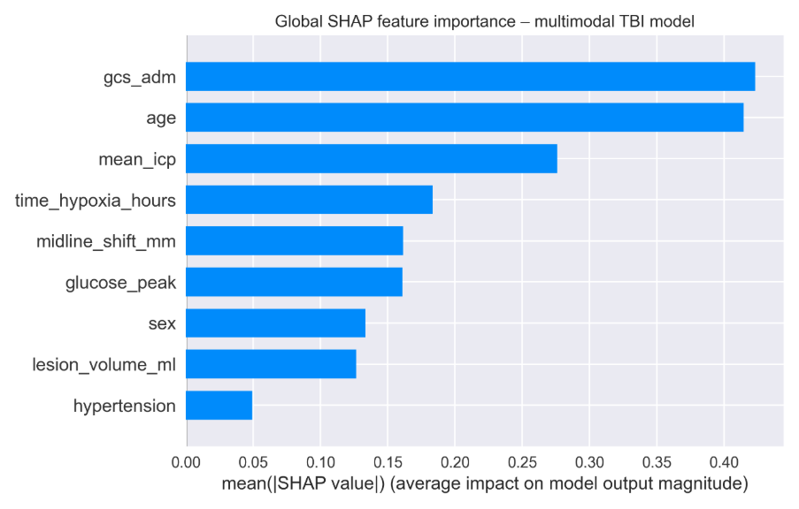
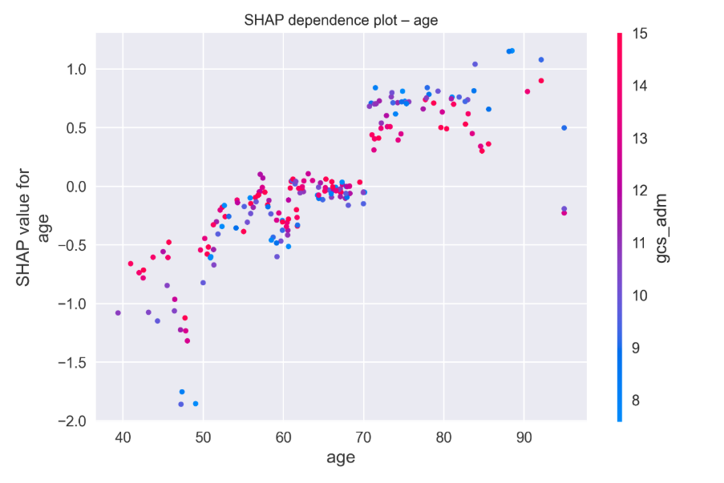
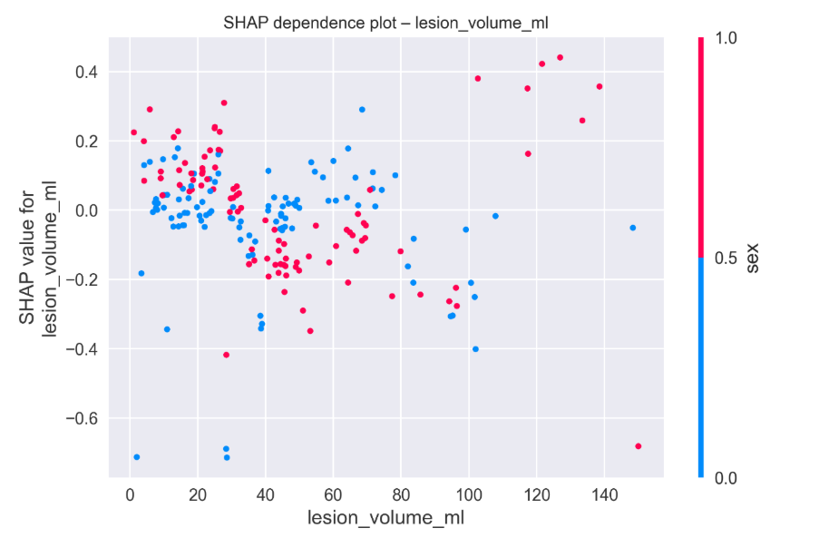
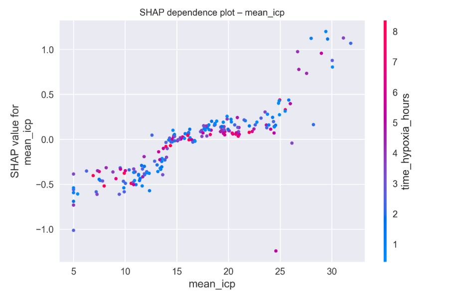
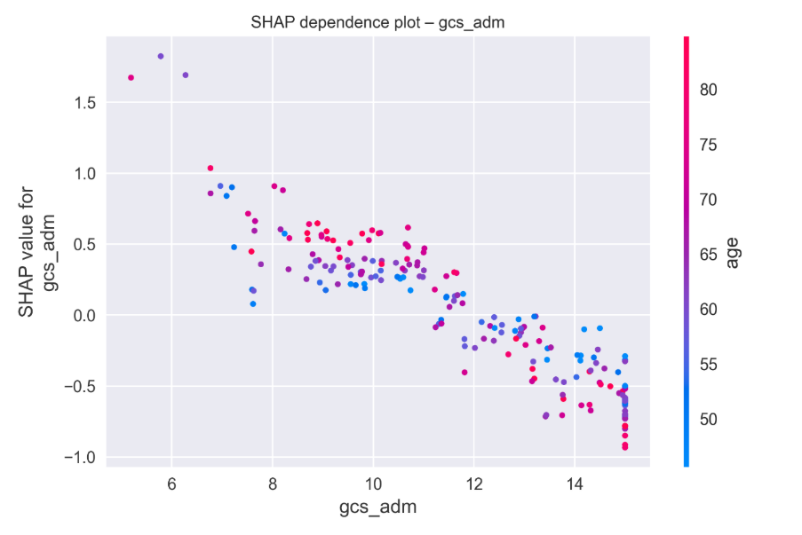
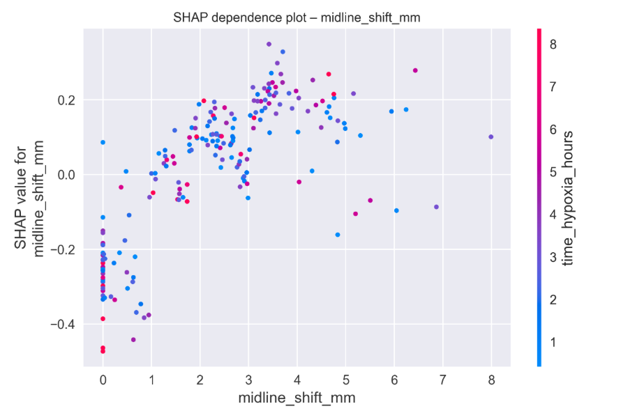

*Target audience: data scientists and analysts, health informaticians, and dementia and neurocognitive researchers.*

{fig-alt="A radiographer supervises a patient entering a CT scanner."}

*Image credit: Hospital-Healthcare Europe, 4 February 2022.*

## Synopsis

Traumatic Brain Injury (TBI) notably increases the risk of dementia by about 24%, and this risk increases with severe injuries [@ref1]. Other research indicates that TBI confers around a 1.5-fold increased risk of dementia and may account for approximately 5% of global dementia cases [@ref21]. Acute and post-acute TBI care results in the generation of rich data streams such as imaging, intensive care monitoring (ICU), electronic health records (EHRs), and, in some cohorts, biomarkers and omics. Integrating these heterogeneous data streams within an analytic framework can reveal trajectories from acute injury to later-life cognitive decline, adding value to both dementia risk prediction and the design of targeted prevention and care [@ref3]. Scalable dementia prediction relies not only on advanced modelling techniques but also on the proper integration of multimodal data. Data for patient-level observations are often acquired and managed within Trusted Research Environments (TREs), as these secure infrastructures are designed to receive, hold, and process sensitive health data safely. With this in mind, a robust TRE infrastructure is required to support the analysis of such data. While the sophistication of predictive models is crucial, the underlying challenge of integrating diverse data sources across all modalities—including imaging, genetics, clinical, and other modalities—must not be overlooked. Effective data harmonization and standardization across these modalities are essential to ensure consistency and interoperability, and we assume that such preparatory work has already been addressed. This assumption stems from the growing body of work and standard practices in the field, which have made significant strides in addressing modality-specific harmonization. With these foundational steps in place, the focus shifts to how we can leverage the resulting integrated data held within TRE infrastructure to enable scalable and accurate predictions.

This article addresses three interlinked themes concerning the use of multimodal data in traumatic brain injury (TBI) research. **Section A** outlines the various modalities and levels of multimodal integration. It distinguishes between *within-modality integration*, which involves combining data of the same type (such as multiple Computed Tomography (CT) scan measures), and *cross-modality integration*, which links diverse data types. For example, imaging, intensive care unit (ICU), and electronic health record (EHR) variables collected for the same individual. In this context, ICU data differ from EHR data in that they provide high-frequency, time-critical observations during acute care, whereas EHR data capture broader, longitudinal clinical information across the patient's care trajectory. Furthermore, Section A differentiates between levels of integration: *patient-level integration* refers to the aggregation of all available data for a single individual, while *cohort- and platform-level integration* involves harmonizing variables across entire studies and data platforms. TBI datasets are used throughout as exemplars to illustrate these approaches. **Section B** focuses on the intersection of data integration and explainable artificial intelligence (XAI). It examines recent advancements in machine-learning methods that not only generate predictive outputs but also produce human-understandable explanations, identifying which features contribute most significantly to the model's predictions. Because TBI–dementia risk modelling is a high-stakes setting where clinicians and patients need to understand and trust model outputs, we use a synthetic multimodal TBI dataset to show how integrated TBI features can be analyzed with SHapley Additive exPlanations (SHAP)-based feature attribution to produce transparent, clinically interpretable risk estimates. **Section C** discusses interoperability and governance: the Dementias Platform UK (DPUK) Data Portal is selected as a leading TRE that carries out the upstream steps of ingestion, curation and harmonization and provides a secure platform for multimodal integration and explainable analytics.

## Key audience takeaways

- **Multimodal TBI Data as a Testbed for Dementia Research.** Acute and follow-up care for traumatic brain injury (TBI) generates a wealth of multimodal data including imaging, ICU, electronic health records (EHR), and biomarkers which can be linked to dementia outcomes later in life. These data serve as a valuable testbed for studying life-course dementia risk.

- **Harmonization and Standardization as Essential Steps.** For real-world data integration, harmonization and standardization of diverse data types are crucial. A common data model (CDM) provides a consistent framework for this process. Examples include the Brain Imaging Data Structure (BIDS) for imaging data and the Observational Medical Outcomes Partnership (OMOP) common data model for electronic health record (EHR) data. Additionally, methods such as ComBat are often used to correct for site or batch effects. This article assumes these upstream standardization steps are already completed and focuses on the subsequent integration process.

- **Data Integration and Explainable AI for Dementia Risk Prediction.** The case study demonstrates how an integrated multimodal dataset can be processed and analyzed with explainable AI workflows. Using synthetic TBI features, we show how integrated patient-level data feeds into tree-based models, with SHAP-based feature attribution providing global and patient-level explanations of risk predictions. In this context, explainable AI refers to machine learning models that generate predictions and provide interpretable insights into how certain features influence these predictions, ensuring clinical transparency.

- **DPUK as a Model for Trusted Research Environments (TREs).** The Dementias Platform UK (DPUK) Data Portal acts as an exemplary TRE that does the "heavy lifting", handling the ingestion, curation, and harmonization of multimodal datasets. It provides a secure environment where integrated data can be analyzed, and explainable AI workflows can be executed to support dementia research.

- **Infrastructure and Integration are the Real Bottleneck.** In the context of dementia risk prediction, the practical challenges lie in infrastructure and data integration, not in the sophistication of algorithms. Effective selection, harmonization, and integration of high-value modalities using platforms like DPUK often offer greater impact than incremental improvements in model architecture.

## Introduction

Dementia is increasingly recognized not as a condition that simply emerges in later life, but as the culmination of exposures and vulnerabilities accumulated across the life course. Among these, traumatic brain injury (TBI) has consistently been linked to a higher risk of subsequent dementia, including specific subtypes such as vascular dementia, with large cohort studies suggesting an approximate 1.5-fold increase in relative risk [@ref1; @ref2].

What makes TBI particularly compelling in this context is not only its clinical significance, but its richness as a data source. Across the acute care pathway, patients contribute neuroimaging (CT, MRI), ICU monitoring, laboratory tests, and EHR data. Large research programmes such as CENTER-TBI and TRACK-TBI have deliberately collected multimodal data at scale, including clinical, imaging, biomarker and outcome information [@ref3; @ref4].

In parallel, dementia research infrastructures such as the Dementias Platform UK (DPUK) Data Portal have transformed how these data can be used. By providing a secure, standards-based environment, DPUK performs the upstream work of ingesting, curating and harmonizing multimodal cohort and linked EHR data and then exposes them to researchers within a Trusted Research Environment (TRE) [@ref10; @ref11].

This article begins where those upstream processes end. Rather than introducing new harmonization pipelines, we assume those initial steps have been completed within a TRE [@ref6; @ref10] and focus on what comes next:

- Data integration—combining harmonized features across modalities into integrated patient-level and cohort-level tables suitable for modelling.
- Explainable AI—using SHAP to interpret models built on these integrated tables.
- TRE infrastructure—using DPUK as an example of a platform that both harmonizes multimodal data and hosts integrated, explainable AI workflows.

## Section A: Modalities and levels of multimodal integration

### A1. Data modalities along the TBI dementia pathway

Following a traumatic brain injury (TBI), patients progress through a series of care stages, beginning with acute medical intervention and continuing with long-term rehabilitation and monitoring. Throughout this care pathway, a variety of data modalities are generated. From a dementia perspective, multimodal data generated after TBI can be categorized into four broad modalities:

- **Neuroimaging**
  - Acute CT (e.g. haemorrhage volume).
  - Follow-up Magnetic Resonance Imaging (MRI) (white-matter integrity, microbleeds, functional connectivity).
- **ICU / physiological monitoring**
  - High-frequency vital signs (blood pressure, heart rate, oxygen saturation).
  - Intracranial pressure (ICP) and derived metrics (mean, peaks, burden).
  - Ventilation parameters and key laboratory time-series.
- **Clinical / EHR data**
  - Demographics, comorbidities, medications.
  - Glasgow Coma Scale (GCS), injury severity, neurosurgical interventions.
  - Linked primary and secondary care diagnoses, including later dementia.
- **Biomarkers / omics**
  - Blood-based markers of neuronal injury and inflammation.
  - In selected cohorts, genomics and other omics panels [@ref5].

Each data modality captures a different aspect of the pathway from acute injury to long-term cognitive outcomes, providing complementary information that can help elucidate the factors influencing later cognitive decline [@ref1; @ref21].

### A2. Harmonization and standardization as initial steps

In real-world TBI and dementia research, these modalities are not initially analysis ready. They must first undergo modality-specific harmonization and standardization, which could be carried out by data platforms and/or TREs:

- Neuroimaging datasets are often organized using structural methods such as the Brain Imaging Data Structure (BIDS), which provides a standardized scheme for folder structures, filenames, and metadata to facilitate consistency and sharing across studies [@ref7].
- EHR and clinical data can be mapped to models like the OMOP Common Data Model (CDM), which standardizes tables and vocabularies for diagnoses, procedures, drugs, and measurements. However, not all EHR datasets are mapped to OMOP, and other mapping methods may also be used [@ref9].
- Multi-site imaging features are frequently harmonized using methods like ComBat, which helps reduce scanner- and site-related batch effects while preserving biological variance [@ref8].

This article does not implement BIDS, OMOP, or ComBat pipelines directly. Instead, we treat them as upstream enablers that can be managed by platforms like DPUK that specialize in data curation and harmonization at scale [@ref6; @ref10].

### A3. Data integration as the next step

Once modality-specific harmonization has been performed, the next step is data integration: bringing together features across modalities into an integrated structure suitable for modelling.

Three levels matter:

- **Patient-level integration**—creating a longitudinal, multimodal record per person, with one row per individual and columns spanning clinical, imaging and ICU features [@ref21].
- **Cohort-level integration**—ensuring variables are comparable across all participants within a study, enabling robust training and validation of prognostic models and subgroup analyses [@ref4; @ref5].
- **Platform-level integration**—harmonizing across multiple cohorts. The Open Data Commons for TBI (ODC-TBI), for example, uses common data dictionaries and FAIR principles to support multi-study reuse and meta-analysis [@ref6]. DPUK uses a multi-layer architecture to integrate many dementia-relevant cohorts and linked EHRs [@ref10].

Our case study starts after these steps: we assume upstream harmonization has been done, and we focus on building and analyzing an integrated patient-level table that approximates what would be available in a platform like DPUK.

### Data integration in the synthetic example

In our synthetic experiment, we emulate this post-harmonization integration step. We do not simulate raw Digital Imaging and Communications in Medicine (DICOM) files or unstructured EHR records. Instead, we simulate *already-harmonized features* from three modalities plus an outcome:

- Clinical / EHR: age, sex, admission GCS (`gcs_adm`), hypertension (0/1).
- Imaging-derived: lesion volume (`lesion_volume_ml`), midline shift (`midline_shift_mm`).
- ICU / physiology: mean ICP (`mean_icp`), hours of hypoxia (`time_hypoxia_hours`), peak glucose (`glucose_peak`).
- Outcome: 12-month cognitive impairment (`cog_impair_12m`, 0/1).

Each variable is simulated as an array of length 1,000, where the *i*-th element in each array corresponds to the same synthetic patient. These arrays are concatenated into a single table with one row per patient and columns spanning all modalities and the outcome. This integrated table is therefore a cross-modality, patient-level dataset analogous to what a researcher would receive inside a TRE like DPUK after the platform has already handled ingestion, harmonization and standardization [@ref10; @ref16; @ref19]. The remainder of the article shows how to analyze such an integrated table using explainable AI.

## Section B: Explainable AI in multimodal TBI dementia analytics

### B1. Why is explainability critical?

Given an integrated multimodal table, the next step is modelling. But TBI and dementia are high-stakes settings: people live with the decisions that models inform. Reviews of explainable AI in healthcare stress that black-box predictions are not sufficient; clinicians need to inspect model reasoning, regulators must understand model behavior, and patients deserve transparent communication of risk [@ref14]. SHAP (SHapley Additive exPlanations) offers a practical approach. It provides consistent, locally accurate feature attributions by approximating Shapley values from cooperative game theory and is widely used in clinical machine learning [@ref13; @ref15]. It yields both global feature importance and local per-patient breakdowns of how features push a prediction up or down.

In TBI, explainable models have been used for tasks such as early sepsis prediction, revealing clinically plausible risk drivers including age, physiological instability and laboratory markers [@ref17; @ref18; @ref19]. Extending such approaches to dementia-related outcomes is mainly a question of having high-quality, integrated multimodal data and a secure environment in which to analyze them [@ref4; @ref5].

### B2. Multimodal + SHAP workflow (schematic)

@fig-workflow sketches the overall workflow for explainable multimodal TBI dementia analytics.

{#fig-workflow fig-alt="Four-stage pipeline diagram: raw multimodal TBI data, upstream harmonisation (BIDS, OMOP, ComBat) within a TRE, cross-modality patient-level integration, and supervised modelling with SHAP explanations."}

### Methods: Synthetic data generation and revalidation

To illustrate the data integration and explainable AI steps without using real patient data, we implemented a synthetic experiment whose structure mirrors contemporary TBI cohorts [@ref4; @ref5; @ref19].

We simulated a cohort of 1,000 adults with moderate-to-severe TBI, with features from the three modalities described above mimicked: a clinical/EHR domain (age, sex, GCS, hypertension), an imaging-like domain (lesion volume, midline shift) and an ICU/physiology domain (mean ICP, hours of hypoxia and peak glucose). For each feature, simple distributions were specified so that simulated values fell within a realistic range. The binary outcome, 12-month cognitive impairment, was generated so that risk increased with older age, larger lesions, greater midline shift, lower GCS, higher ICP, longer hypoxia, hypertension and hyperglycaemia, reflecting the chosen coefficients to be qualitatively consistent with published TBI prognostic studies [@ref4; @ref5; @ref18; @ref19]. Thus, the dataset serves as a realistic but entirely artificial mock-up of an already harmonized, integrated multimodal TBI feature table inside a TRE (such as DPUK), while ensuring that no real-world TBI or DPUK data were accessed or disclosed. We split the dataset into training (80%) and test (20%) sets and trained a gradient-boosted tree classifier. Feature attributions were computed on the test set using SHAP's Tree Explainer, following Lundberg and Lee [@ref15]. The purpose of this approach was not to reproduce any real cohort, but to create an artificial multimodal table that resembles what a post-harmonization dataset inside a trusted research environment such as DPUK might look like. Because the data were synthetic, revalidation focused on whether the generated dataset remained analytically credible for the intended demonstration. This involved checking that variable ranges were plausible and that the relationships built into the simulation remained clinically sensible. It also involved confirming that the integrated table could support downstream prediction modelling without obvious instability or contradiction in the direction of effects. In this setting, revalidation is not the same as external validation against a real cohort. It is a check that the synthetic data remain coherent enough to support a methodological illustration of multimodal integration, prediction modelling and explainability. This distinction is consistent with the broader synthetic health data literature, which treats generation and evaluation as related but separate stages and places emphasis on fidelity, utility and disclosure risk [@ref23; @ref24]. This simple simulation strategy is necessarily limited. It does not capture the full complexity of real multimodal TBI data, including missingness, temporal dependence, measurement noise, or site-specific heterogeneity. Even so, it remains useful for showing how a harmonized multimodal table can be assembled, checked, and carried forward into a downstream modelling workflow inside a trusted research environment. Having outlined how the synthetic data were generated and revalidated, the next step is to assess whether the integrated table supports a coherent prediction task before turning to SHAP-based interpretation.

### B3. Prediction model results before SHAP interpretation

Before examining feature attributions, the synthetic multimodal dataset was first used to fit a supervised prediction model for 12-month cognitive impairment. As described in the case study, the integrated table was divided into training and test sets using an 80:20 split, and a gradient-boosted tree classifier was trained on the synthetic multimodal features. This stage of the analysis comes before SHAP because explanation does not replace model evaluation. The synthetic dataset had a cognitive impairment prevalence of 0.723, indicating a marked class imbalance towards the impaired group. Model performance was evaluated on the held-out test set, where the gradient-boosted classifier achieved an area under the receiver operating characteristic curve of 0.685. In the context of a synthetic demonstration, this should not be read as evidence of clinical readiness. Rather, it shows that the integrated multimodal table supports a non-trivial prediction task and that the fitted model captures some meaningful separation between lower-risk and higher-risk synthetic cases. That level of predictive performance is sufficient to justify moving to model interpretation, while still requiring caution in how the results are framed. The purpose here is not to claim a deployable prognostic tool, but to show that once harmonized multimodal features are brought together into a single patient-level table, they can be used to fit and assess a prediction model before examining how individual features contribute to model output. SHAP is therefore used here as a secondary interpretive step applied to an already-evaluated model, rather than as the primary result in its own right. With the prediction model established in this way, SHAP can then be used to examine which multimodal features drove the model's output and how those effects appeared at both global and individual level.

### Synthetic multimodal TBI SHAP experiment

With the prediction model established in this way, SHAP can then be used to examine which multimodal features drove the model's output and how those effects appeared at both global and individual level.

We produced three types of plots:

- A global SHAP summary plot ranking features by overall importance (@fig-shap-global) and individual feature importance.
- SHAP dependence plots for age, lesion volume, mean ICP, GCS and midline shift (@fig-dependence).
- An individual-level waterfall plot decomposing a single patient's prediction into feature-wise contributions (@fig-waterfall).

Although synthetic, these plots demonstrate how a genuinely integrated multimodal feature table can be turned into clinically interpretable explanations.

### B4. Results and interpretation of the synthetic SHAP analyses

::: {#fig-shap-global layout-ncol=1}

{#fig-beeswarm fig-alt="SHAP beeswarm summary plot ranking features by impact on model output."}

{#fig-barimp fig-alt="SHAP bar chart of mean absolute SHAP value per feature."}

Global SHAP summary for the synthetic multimodal TBI model.
:::

Lesion volume, mean ICP, age, midline shift and admission GCS emerged as the most influential predictors. High lesion volume and ICP values tended to push predictions toward impairment, while higher GCS scores tended to reduce risk. This mirrors clinical understanding that older age, greater intracranial injury burden and sustained intracranial hypertension drive worse outcomes after TBI [@ref4; @ref5; @ref19].

#### Non-linear risk relationships

@fig-dependence presents SHAP dependence plots for age, lesion volume, mean ICP, admission GCS and midline shift. These plots reveal non-linear patterns: predicted risk rises steeply once lesion volume exceeds a moderate threshold and once mean ICP remains above clinically relevant levels; lower GCS values show a monotonic association with higher risk. Such plots demonstrate how the model leverages multimodal information and make these risk relationships visually accessible.

::: {#fig-dependence layout-ncol=2}

{#fig-dep-age fig-alt="SHAP dependence plot for age."}

{#fig-dep-lesion fig-alt="SHAP dependence plot for lesion volume."}

{#fig-dep-icp fig-alt="SHAP dependence plot for mean intracranial pressure."}

{#fig-dep-gcs fig-alt="SHAP dependence plot for admission GCS."}

{#fig-dep-midline fig-alt="SHAP dependence plot for midline shift."}

SHAP dependence plots for key multimodal predictors. Plots for age, lesion volume, mean intracranial pressure, admission GCS and midline shift in the synthetic TBI model highlight non-linear relationships between each feature and predicted risk, such as sharply increasing risk at higher lesion volumes and ICP, and monotonically lower risk with higher GCS.
:::

#### Individual-level explanation

@fig-waterfall shows a SHAP waterfall plot for a single high-risk patient. The baseline risk is incrementally increased by older age, large lesion volume, elevated mean ICP and prolonged hypoxia, with partial mitigation from a relatively preserved GCS. The resulting narrative—"this patient is high risk mainly because of age, large contusions, sustained ICP elevation and hypoxia"—is far more interpretable than a bare probability and aligns naturally with how clinicians think about TBI risk profiles.

{#fig-waterfall fig-alt="SHAP waterfall plot decomposing one patient's predicted risk into feature contributions."}

### B5. Implications and caveats

Although synthetic, this example qualitatively resembles patterns from empirical TBI prognostic studies, where age, injury severity, intracranial lesions and physiological derangements drive poor outcomes [@ref4; @ref5; @ref18; @ref19]. It shows how, once multimodal features have been harmonised upstream and integrated into a single table, SHAP can make model behaviour transparent at both population and individual levels.

Important caveats include the simplification of temporal dynamics, the need for robust handling of missing and biased data, and the risk of over-interpreting from poorly calibrated models [@ref14; @ref15]. The synthetic example is best seen as a template for what could be run on real TBI data inside a TRE such as DPUK.

## Section C: Interoperability and the DPUK Dementia Platform as an operational TRE

### C1. Interoperability and TREs

In this context, interoperability has three dimensions:

- **Data interoperability**—datasets adopt shared formats (e.g. BIDS), models (e.g. OMOP) and metadata, enabling linkage and reuse [@ref7; @ref9].
- **Analytical interoperability**—pipelines run across datasets and environments using standardized, containerized tools [@ref10; @ref11; @ref20; @ref21].
- **Governance interoperability**—TREs align on information-governance principles, often guided by the "Five Safes" framework promoted by Health Data Research UK [@ref12].

Trusted Research Environments operationalize these principles by providing secure, audited platforms for working with sensitive health data.

### C2. The DPUK Data Portal as an end-to-end platform

The DPUK Data Portal is a UK TRE designed for dementia research. It integrates over 3.5 million participants across more than 50 cohorts, with modalities spanning phenotypic data, neuroimaging, genetics and linked EHRs [@ref10; @ref11].

Critically, DPUK does much of the upstream work that this article treats as assumed:

- Ingestion and curation of datasets from diverse studies.
- Harmonization and standardization, often using BIDS for neuroimaging and harmonized metadata or common data models for phenotypes and outcomes [@ref7; @ref10; @ref11].
- A layered architecture that includes platform, interoperability and analysis layers, enabling integrated, cross-cohort analyses [@ref10; @ref11].

Once data is curated and harmonized, DPUK provides access to them inside a secure virtual desktop environment where researchers can carry out data integration and modelling, including SHAP analyses like the ones illustrated here. Data never leaves the TRE; outputs undergo disclosure control [@ref10; @ref12]. This infrastructure also supports domain-specific hubs such as the TBI Reporter Hub, which operates within DPUK to facilitate secure, harmonized data access and analysis for traumatic brain injury research.

### C3. Towards federated TRE ecosystems

Recent guidance emphasizes that TREs should support federated analysis and ensure data security while avoiding the creation of new silos. This is particularly crucial for multimodal TBI dementia research [@ref12]. As highlighted in recent work, federated systems can enable collaborative research without compromising data privacy. For this context, federated approaches could involve:

- **Running containerized SHAP workflows across multiple TREs without transferring raw data**, ensuring that sensitive data remains within local institutions while still enabling powerful cross-site analysis. This approach ensures compliance with privacy regulations while maintaining research collaboration [@ref22].
- **Employing federated harmonization methods** that minimize site-specific variations, ensuring consistent data quality while maintaining local control over sensitive data. Federated harmonization allows for greater consistency across datasets without compromising local data privacy and sovereignty [@ref8; @ref22].
- **Sharing model artifacts and explanation templates between TREs**, adhering to disclosure controls to ensure that machine learning models and their insights are transparent yet protected. This approach ensures that models are interpretable and that their explanations are shared securely across platforms without violating privacy or intellectual property concerns [@ref22].

In this vision, platforms like DPUK not only manage multimodal data and perform necessary harmonization and standardization but also provide a trusted computational substrate. This enables the deployment of integrated, explainable AI workflows securely and at scale, all while upholding the highest standards of data privacy and governance as outlined in current frameworks [@ref22].

## Conclusion

TBI offers a powerful lens through which to understand how multimodal data can be brought together to advance dementia research. The acute phase of injury generates a uniquely rich set of data from imaging, ICU, and EHR sources, which, when linked to long-term outcomes, offer insights into how early structural and physiological events contribute to later cognitive decline.

As we have shown, the real work begins before modelling. Harmonization and standardization, typically carried out by platforms like DPUK, are essential foundations. Once these steps are complete, integrating multimodal features into coherent patient- and cohort-level datasets creates the conditions for meaningful analysis. Explainable AI methods, such as SHAP, then build on this foundation by translating complex models into interpretable narratives that clinicians and patients can trust. DPUK's Trusted Research Environment (TRE) facilitates this entire pipeline, managing the ingestion, harmonization, and secure hosting of multimodal data, while providing environments that allow integrated, explainable AI workflows to operate at scale.

Rather than relying on AI to compensate for messy data, the TBI dementia use case demonstrates that harmonized, integrated multimodal data and robust TRE infrastructure are prerequisites for meaningful, explainable AI. Beyond the specific case of TBI and dementia, there is a broader lesson: effective AI is not a remedy for disordered data, it is the product of well-designed data pipelines. For data practitioners, the transferable insight is that value emerges from the sequence: careful harmonization, thoughtful integration, and only then modelling with built-in explainability, all supported by robust infrastructure. Platforms like DPUK exemplify how this can be operationalized in practice, turning complex, multimodal data into transparent and actionable insights for dementia risk prediction.

All code used to generate the synthetic dataset and SHAP analyses is available in the [GitHub repository](https://github.com/kaffy90/Integrating-multimodal-data-for-dementia-research-the-approach-with-traumatic-brain-injury-data).

## References

::: {#refs}
:::

::: {.article-btn}
[Back to section homepage](url)
:::

::: {.further-info}
::: grid
::: {.g-col-12 .g-col-md-12}
About the authors
: [Kafayat Adeoye](https://www.linkedin.com/in/kafayat-adeoye/) is a computational health data scientist with experience building AI models and data pipelines on large-scale, heterogeneous health datasets. She currently works at [Dementias Platform UK](https://www.dementiasplatform.uk/), where her research focuses on translating traumatic brain injury data into clinically meaningful insights. She holds an MSc in Computer Science (AI) with from the University of Nottingham and a BEng in Electronic Systems Engineering from the University of Portsmouth.
: [Emma Squires](https://www.linkedin.com/in/emma-squires-977b6717a/) is Chief Operating Officer for [DPUK](https://www.dementiasplatform.uk/) and Head of Programmes and Innovation for [SeRP](https://serp.ac.uk/). She leads the design, governance, and delivery of Trusted Research Environments supporting over 1,300 users and 100+ datasets. Emma specialises in translating strategy into scalable, secure research infrastructure, and oversees major national programmes including TBI‑REPORTER and the MND Research Catalyst. She also contributes to AI governance and synthetic data policy, with a focus on enabling trusted, high-impact research at scale.
: [Fatemeh Torabi](https://www.linkedin.com/in/fatemeh-torabi-909190b3/) is an Assistant Professor in Healthcare Data Science at the University of Cambridge and Senior Researcher. She works at the intersection of advanced analytics, real-world data, and translational impact. Her research develops innovative statistical and computational methods for risk prediction, treatment optimisation, and study design in long-term conditions such as cardiovascular disease. She has also pioneered methodologies for data quality assessment, disease phenotyping, and the integration of population-scale datasets.
[Prof. Simon Thompson](https://www.linkedin.com/in/simon-thompson-0b35546/) is a professor of Health Informatics and Deputy Associate Director at [DPUK](https://www.dementiasplatform.uk/), playing an instrumental role in the ongoing development of the DPUK Data Portal. He is a systems architect with many years’ experience in the NHS and academia, and Chief Technology Officer of a large team of talented and diversely skilled software developers. Simon leads the innovation, design, development and implementation of all SeRP technical system developments. He is responsible for delivering the technical workstream for Swansea University as part of a UK network of e-research centres of excellence and international collaboration.
:::
::: {.g-col-12 .g-col-md-6}
Copyright and licence
: &copy; 2025 Kafayat Adeoye, Emma Squires, Fatemeh Torabi and Simon Thompson

 This article is licensed under a Creative Commons Attribution 4.0 (CC BY 4.0) <a href="http://creativecommons.org/licenses/by/4.0/?ref=chooser-v1" target="_blank" rel="license noopener noreferrer" style="display:inline-block;"> International licence</a>. Thumbnail photo credit: Hospital-Healthcare Europe.
:::
::: {.g-col-12 .g-col-md-6}
How to cite
: Adeoye, Kafayat, Emma Squires, Fatemeh Torabi, and Simon Thompson. 2026. "Linking Brain Injury to Cognitive Decline: A Multimodal, Explainable AI Approach within Trusted Research Environments." Real World Data Science, Month Day, Year. [URL](url)
:::
:::
:::
