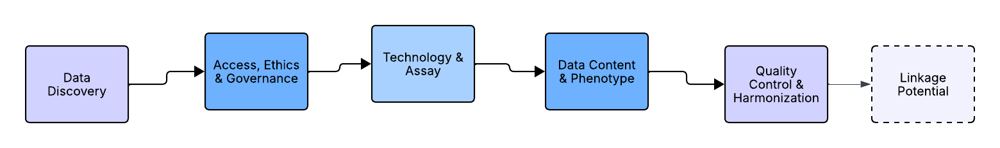

While the term “genomic data” encompasses a wide range of data types (e.g., RNA-seq, single-cell sequencing, ChIP-seq), this article focuses specifically on datasets derived from GWAS and sequencing-based studies (WES/WGS), given their prominence in disease genetics research.

This guide is aimed at researchers who may be experts in clinical, epidemiological, or data-science domains but are relatively new to working with genomic data. We assume no prior experience with genotyping platforms or sequencing pipelines, focusing instead on the key questions you need to ask before committing to a dataset.

Although we present the five pillars as a logical framework for evaluation, in practice ethical and governance considerations act as an initial gatekeeper. This reflects the foundational role of international frameworks like the GA4GH Framework for Responsible Sharing [1] and the WHO's ethical principles for genomic data [2], which provide the essential governance context within which all technical decisions are made. Before assessing technical suitability, researchers should first establish whether they are permitted to access and use a dataset at all, and whether institutional or regulatory approval (such as ethics committee or Institutional Review Board (IRB) review) is required. If a dataset cannot be used ethically or legally for a given research question, no level of technical suitability can compensate.

## Introduction: Navigating the Data Deluge
The greatest challenge in modern genomics is no longer generating data, but knowing which data can actually answer your question.

Genomic data has become a fundamental pillar of biomedical discovery, fuelling advancements from Genome-Wide Association Studies (GWAS) to Polygenic Risk Scores (PRS) and rare variant analyses, including those informing novel therapeutic approaches like CRISPR-based gene therapies [3]. This wealth of data holds immense promise for elucidating the genetic architecture of disease, personalising therapeutic strategies, and accelerating drug development.

However, for researchers new to genomics, the initial challenge is often not the complexity of the analysis, but the complexity of the data landscape itself; a challenge well-documented in the literature. This includes the sheer scale of data, where individual genomes can exceed 100 gigabytes of information [4], the significant ethical and logistical hurdles in managing it [5, 6], and the persistent issue of non-representative data that limits equitable progress [2, 7]. The pivotal question, “*Which genomic dataset is right for my research?”,* can be daunting. Navigating a maze of biobanks, consortia, and public repositories, researchers are confronted with a bewildering array of technical jargon and specifications. Selecting an unsuitable dataset can lead to months of wasted effort, irreproducible results, and fundamental biases that undermine scientific validity.

This article enriches existing approaches by providing a solution: a clear, structured framework designed to guide researchers in systematically evaluating and selecting genomic datasets. We move beyond simple catalogues of resources to dissect the critical decision-making process. By interrogating any potential dataset across five core pillars, you can ensure the data you source is robust, fit for purpose, and capable of driving reliable science, whether for GWAS, PRS, exome analysis, or other downstream applications.

Researchers often turn to existing genomic datasets rather than generating new data due to several key motivations: Cost efficiency, as sequencing and genotyping are resource-intensive; Access to larger sample sizes than may be feasible for individual studies; The ability to leverage well-phenotyped cohorts with longitudinal or linked data; As well as accelerating research by building on previously harmonized and QC-ed data. Common sources for such data include public repositories such as dbGaP, EGA, the NCI Genomic Data Commons (GDC), and databanks such as UK Biobank, FinnGen, and the UK’s National Genomics Research Library (NGRL).

## The Core Framework: The Five Pillars of Genomic Data Selection
Before downloading data, a researcher must interrogate it across five key dimensions. These pillars form a checklist of non-negotiable considerations that determine technical compatibility, scientific utility, and practical feasibility. Importantly, most of these questions can, and should, be answered before you apply for access or begin data transfer. Doing so can prevent months of downstream re-analysis or worse, discovering too late that a dataset is fundamentally unsuited to your research question.

{#fig-five-pillar-framework fig-align="center"}

### Pillar 1: Data Discover (The “Where Do I Even Find It?”)
Before you can interrogate a dataset's governance, technology, or content, you must first know it exists and be able to locate it. For researchers new to the field, the sheer number of repositories, consortia websites, and data portals can be overwhelming. This pillar provides a roadmap for navigating this discovery phase, transforming a frantic search into a systematic hunt. The goal here is not to download data, but to identify a shortlist of candidate datasets that warrant the deeper, pillar-by-pillar evaluation outlined in the rest of this framework.

* **Defining Your Data Wishlist:** The discovery process should be guided by a clear, pre-defined set of criteria derived from your research question. Before you open a single browser tab, jot down your non-negotiables. This wishlist is a distilled version of the other pillars and will be your compass. Ask yourself:

* **Disease/Phenotype:** What traits or diseases must be present? (e.g., “Alzheimer's disease with cerebrospinal fluid biomarkers”, “type 2 diabetes with longitudinal BMI data”, “rare paediatric developmental disorders with parental data”).
* **Data Type:** What is the fundamental genomic data needed? (e.g., “Genome-wide genotyping array data for PRS”, “Whole-genome sequencing for structural variant analysis”, “Exome sequencing for rare variant burden tests”).
* **Minimum Sample Size:** What is the smallest number of cases or total participants needed for adequate statistical power?
* **Population Ancestry:** Is the study focused on a specific genetic ancestry or requires a diverse, multi-ancestry cohort?

* **Navigating the Discovery Landscape:** With your wishlist in hand, you can strategically explore the ecosystem of genomic data resources. These fall into several categories:

* **Generalist Repositories:** These are large, international archives that house data from thousands of individual studies. They are often the first place to look.
* [dbGaP (Database of Genotypes and Phenotypes)](https://dbgap.ncbi.nlm.nih.gov/home/): The primary repository for US-funded studies.
* [EGA (European Genome-Phenome Archive)](https://ega-archive.org/): The European counterpart, hosting numerous European and international studies.
* [NCI GDC (Genomic Data Commons):](https://gdc.cancer.gov/) A highly harmonized repository focused on cancer research, containing data from projects like The Cancer Genome Atlas (TCGA).

* **Major Biobanks & Cohort Databases:** These are large-scale, prospective collections of data from hundreds of thousands of participants. They are ideal for researchers who need deep phenotyping and large sample sizes under a single, consistent data access policy.
* [UK Biobank:](https://www.ukbiobank.ac.uk/) A premier resource for population health.
* [FinnGen:](https://www.finngen.fi/en) Provides unique insights into a founder population.
* [All of Us Research Program](https://allofus.nih.gov/): A US-based cohort explicitly focused on diversity and precision medicine.
* [BioBank Japan](https://biobankjp.org/en/#gsc.tab=0): A rich resource for studying non-European populations, containing genomic and clinical data from over 200,000 Japanese individuals with a focus on common lifestyle diseases.
* [Estonian Biobank:](https://genomics.ut.ee/en/content/estonian-biobank) A population-based biobank with over 200,000 participants, representing a significant proportion of Estonia's adult population and offering a valuable resource for studying a national cohort.

* **Specialised National Initiatives & Platform-Based Resources:** These resources often provide not just data, but also secure analysis environments, making them particularly valuable for researchers with limited local computational infrastructure. They are often disease-focused or clinically driven.
* [Dementias Platform UK (DPUK)](https://www.dementiasplatform.uk/): A UK-based platform that brings together over 60 cohorts of dementia-relevant data, totalling more than 3.5 million participants. Critically, DPUK provides a secure cloud-based Data Portal where approved researchers can access and analyse linked genetic, imaging, cognitive, and biomarker data without needing to download massive files locally.
* [National Genomics Research Library (NGRL)](https://www.genomicsengland.co.uk/blog/genomics-101-what-is-the-national-genomic-research-library): Part of Genomics England, this is a growing collection of whole-genome sequences from NHS patients. It is particularly valuable for rare disease research and novel variant interpretation due to its clinical-grade sequencing data and linkage to rich, longitudinal NHS health records. Access is managed through the secure Genomics England Research Environment.
* [Canadian Partnership for Tomorrow Project (CPTP)](https://canpath.ca/): A pan-Canadian platform pooling data from over 300,000 Canadians across multiple regional cohorts, offering a powerful resource for studying how genetics, environment, and lifestyle interact to influence cancer and chronic disease risk.

* **Specialized Consortia and Project Websites:** Many large, collaborative scientific consortia have their own data access portals or provide clear instructions on how to apply for their specific datasets. These are invaluable for research into a particular disease area.
* [Psychiatric Genomics Consortium (PGC)](https://pgc.unc.edu/): The world's largest mental health genomics consortium, with access protocols for using their meta-analysed GWAS summary statistics and, in some cases, individual-level data from dozens of contributing studies.
* [International Common Disease Alliance (ICDA)](https://icda.bio/): A global consortium aiming to understand the genetic architecture of common diseases, providing access frameworks and harmonized datasets from multiple contributing studies.
* [The GTEx Project (Genotype-Tissue Expression)](https://gtexportal.org/home/): A specific and highly influential project focused on understanding how genetic variation affects gene expression across different human tissues, with its own dedicated data portal.

* **The Power of Discovery Tools:** You do not need to manually search every repository website. A new generation of powerful discovery tools acts as a search engine for genomic and biomedical data, allowing you to query across multiple repositories at once.
* **Repository Portals:** The EGA and dbGaP themselves have advanced search features to filter studies by disease, data type, and publication.
* **Federated Search Tools:** Platforms like the [NHGRI AnVIL (Genomic Data Science Analysis, Visualization, and Informatics Lab-space)](https://anvilproject.org/) and the [GA4GH Beacon project](https://www.ga4gh.org/product/beacon-api/) aim to make data findable by allowing researchers to query across multiple datasets to see if specific genetic variants or phenotypic information exists, without needing to access the full data first. Using these tools can save weeks of manual searching.

By systematically applying your wishlist to the landscape of repositories and using modern discovery tools, you move from a vague need for “genomic data on heart disease” to a concrete list of potential datasets, such as “UK Biobank”, “dbGaP study phs000007 (FHS)”, “the Alzheimer's cohorts within DPUK,” and “NCBI GDC's TCGA-BRCA project”. Only once you have this shortlist can you begin the deep, critical evaluation defined by Pillars 1 through 5.

### Pillar 2: Access, Ethics & Governance (The “Can I Use This Responsibly?”)
Once you have discovered the appropriate dataset, the next step is to establish whether you can access it ethically; all ethical and governance considerations should be addressed before investing time in detailed technical assessment or data preparation. Researchers should determine whether their proposed use aligns with participant consent, data access agreements, and institutional requirements. In many cases, this includes assessing whether approval from an ethics committee or Institutional Review Board (IRB) is required, and at what stage such approval must be obtained.

The most suitable dataset scientifically is useless if you cannot access it or use it within a responsible governance framework. This pillar now encompasses the global standards for ethical data stewardship and the practical realities of gaining and maintaining access.

* **Data Access Models & Governance:** Genomic data exists on a spectrum of accessibility. Understanding where your shortlisted datasets fall on this spectrum is your first practical task.
* **Open Access:** Some resources, like the 1000 Genomes Project or GTEx, provide openly available data, typically summary statistics or fully anonymized data, with minimal access barriers.
* **Controlled Access:** Most individual-level genomic data sits behind controlled access regimes. Reputable resources like dbGaP, EGA, and FinnGen require researchers to submit a project proposal for review by a Data Access Committee (DAC). The DAC evaluates whether your proposed use aligns with the participant consent and data use limitations. Usage terms might involve a contract or a non-disclosure agreement (NDA), which will have to be reviewed by your institution’s legal team and signed by a designated institutional signee.
* **Managed/Platform Access:** A growing number of resources, including UK Biobank, Dementias Platform UK (DPUK), and Genomics England (NGRL), operate a managed access model. Here, you apply to use the data within a secure, cloud-based Research Environment or Trusted Research Environment (TRE). You do not download the data; you bring your analysis to it. This model enhances data security and democratizes access for researchers who may lack local high-performance computing infrastructure.

* **Foundations of Responsible Research:** Modern genomic research operates within established ethical frameworks. The *Global Alliance for Genomics and Health (GA4GH) Framework for Responsible Sharing* provides foundational principles such as transparency, accountability, and promoting benefit, that guide international data sharing. Furthermore, the *FAIR Guiding Principles (Findable, Accessible, Interoperable, Reusable)* are a benchmark for high-quality, reusable data management that many repositories strive to meet.
* **Informed Consent & Use Limitations:** Scrutinise the consent conditions. What research purposes are permitted? Note that even within “health-related research”, there can be debates about appropriate use, such as applications in insurance or non-medical trait prediction. Platforms like UK Biobank and DPUK explicitly exclude certain users, like insurance companies, from direct data access.
* **The Practicalities of Gaining Access:** Access is rarely instantaneous. You must factor in the time and administrative steps required.
* **Application & Review:** Preparing a project proposal for a DAC takes time. The review process itself can take weeks or even months. Plan accordingly.
* **Costs of Access:** While many repositories are non-commercial, access is not always free. Be aware of potential costs:
* **Application or administration fees:** Some resources charge a nominal fee to process applications.
* **Data egress and compute costs:** In cloud-based platforms like the UK Biobank Research Analysis Platform or Terra, you may incur costs for data storage and the computational time used to run your analyses. It is essential to understand the pricing model before you start.
* **Membership/Consortium fees:** Accessing data from some consortia may require your institution to be a member or contributor.
* **Mandatory Training:** Many data access providers, particularly in the UK and Europe, require researchers to complete specific accredited training before they are granted access. Common examples include:
* **Good Clinical Practice (GCP):** Often required when working with clinical trial data or data derived from clinical settings.
* **Accredited Researcher Training:** Programmes like the ONS (Office for National Statistics) Safe Researcher training or similar accredited courses are mandatory for accessing data within many TREs, including DPUK and UKSeRP. These courses cover the principles of data privacy, disclosure control, and secure handling of sensitive information.
* **Computational Logistics:** Genomic data is vast. Analyzing feasibility is crucial; WGS data for 100,000 individuals requires terabytes of storage and high-performance computing. Many platforms now offer cloud-based analysis environments (e.g., Dementia’s Platform UK, Genomics England Research Environment, UK Biobank Research Analysis Platform) to democratize access.

Importantly, ethical constraints may shape study design itself (e.g., limiting commercial use, cross-border data transfer, or linkage with external datasets) and should therefore inform all downstream methodological choices.

### Pillar 3: Technology & Assay (The “How” of Data Generation)
The technological origin of the data defines its fundamental nature, scope, and limitations. For a researcher navigating the genomics landscape, the core question is simple: What was measured, and how does that determine what I can and cannot find?

* **Genotyping Arrays:** These are the cost-effective workhorses for large-scale biobanks like UK Biobank and FinnGen. They directly measure a pre-selected set of common single nucleotide polymorphisms (SNPs) across the genome. If your research question focuses on common genetic variation associated with complex diseases, array data is often the most appropriate and scalable starting point.
* **The Key Concept:** *Imputation:* Array data is almost always statistically imputed to infer millions of additional variants not directly measured on the chip. This process uses a reference panel (e.g., TOPMed, 1000 Genomes) to predict missing genotypes. For a researcher, the crucial point is that the choice and version of the reference panel directly impacts the number, quality, and ancestral diversity of the variants available for your analysis. A dataset imputed with a diverse, population-matched panel will always be superior for your downstream work.
* **Sequencing (Whole Exome/Genome - WES/WGS):** Sequencing provides a more comprehensive readout, identifying variants across the entire genome (WGS) or just the protein-coding regions (WES). If your research question involves rare variants, structural variants, or novel mutations not captured on standard arrays, sequencing is the necessary technology.

  o   **The Key Concept:** *Coverage Depth*: The reliability of sequencing data hinges on coverage depth; the number of times a given nucleotide has been read. Low-coverage sequencing (e.g., 4x WGS) is sufficient for some imputation-based analyses, but high coverage (typically ≥30x for WGS, ≥50-100x for WES) is essential for confident rare variant discovery in individual patients.

  o   **Variant Calling Pipeline:** The bioinformatic pipelines used for alignment, variant calling, and filtering (e.g., GATK, Dragen) can influence the final variant set. Understanding the pipeline version and quality thresholds applied is crucial.

No single technology is universally superior, the optimal choice depends entirely on whether your research question prioritises common variant association, rare variant discovery, or structural variation.

### Pillar 4: Data Content & Phenotypic Context (The “What” and “Who”)
The scientific value of a genomic dataset is inextricably linked to the richness and rigour of its associated phenotypic data.

* **Representativeness and Generalizability:** The genetic ancestry of the cohort is critical: it affects the generalisability of findings and is essential for *controlling population stratification*; a major source of false positives. Population stratification occurs when cases and controls are drawn from sub-groups with different ancestral backgrounds, leading to false associations. For instance, a GWAS on height might incorrectly identify a variant common in Northern Europeans as associated if the case group has a higher proportion of Northern European ancestry than the control group. One can control for such situations by including genetic principal components (PCs) derived from the genomic data itself as covariates in the association model, which adjusts for underlying ancestry differences. Beyond ancestry, it is essential to consider whether the population in which the data were collected is representative of the population you aim to study, including factors such as age range, sex distribution, recruitment strategy, disease severity, and socioeconomic or geographic context. A dataset may be statistically powerful yet poorly suited to answering questions about broader or different populations. As such, this is a basic but crucial epidemiological principle. Ask: Were participants recruited through broad population registries (enhancing representativeness), or through specialist clinics or volunteer schemes (which can introduce "healthy volunteer" or other selection biases)? Findings from a non-representative sample may not generalize to your target population; for example, genetic risk variants identified in a hospital-based case-control study may not apply to individuals with milder forms of the disease in the community. Always align the cohort's sampling strategy with the goal of your research, whether it is discovery (where breadth is key) or mechanistic insight (where depth may be prioritized).
* **Phenotype Depth & Relevance:** Does the dataset contain the specific clinical diagnoses, biomarkers, or questionnaire outcomes needed to test your hypothesis? Assess the measurement methods, validation, and clinical definitions used. Keep an eye out for phenotype misclassification as a risk, especially in electronic health data derived trait.
* **Sample Size:** Sample size directly determines statistical power. As an example, In the UK, the National Genomics Research Library (NGRL) serves as a key managed-access resource for researchers. It is particularly valuable for rare disease research and novel variant interpretation due to its clinical-grade sequencing data from the NHS. However, its current cohort structure may not provide the very large sample sizes required for well-powered common variant GWAS of complex traits.
* **Cohort Design:** Is the study a case-control, prospective cohort, or family-based design? The design dictates the analytical methods you can employ and influences the interpretation of results.

  o   **Population-Based Cohorts** are a large, often prospective, sample of individuals from a general population, typically not selected for any specific disease. Participants are followed over time. This type is Ideal for estimating disease incidence, studying a wide range of health outcomes, and calculating population-attributable risks. They are the gold standard for initial *GWAS discovery* for complex traits because they minimize certain selection biases. Some things to consider would be phenotype prevalence (especially for rare diseases), phenotype depth (often lacking) and temporality (can establish that the genetic variant was present before the disease, supporting causal inference).

  o   **Case-Control Studies** are studies where individuals with a specific disease or trait (cases) are recruited and compared to a group without the disease (controls). This type is highly statistically efficient for *studying the genetic basis of a specific disease*, especially rare diseases. This is the most common and powerful design for *focused GWAS* and *rare variant association tests*. Things to consider would be control selection (sourced from the same underlying population as cases), awareness of spectrum (milder and more severe cases for generalizability of found causal variants), and prevalence (not suitable for finding it in population).

  o   **Family-Based Studies (Trios, Sibships, Pedigrees)** where genetic data is collected from related individuals, most classically from affected offspring and both parents (trios). This design is uniquely powerful for detecting *de novo mutations* (new mutations in the child) and for *studying inheritance patterns*. They are inherently controlled for population stratification because family members share genetic background. Some constraints are that recruitments of trios or larger pedigrees are often challenging, and specificity (findings are more relevant for early-onset or highly heritable disorders, and less for discovering common variants associated with complex traits compared to large case-control studies).

  o   **Longitudinal / Prospective Cohorts** involve a subset or special feature of population-based or clinical cohorts where participants undergo repeated phenotypic assessments over months, years, or decades. This type is essential for studying *disease progression, time-to-event outcomes, age-related penetrance of genetic variants, and dynamic traits* like changes in biomarker levels. Prospective cohorts allow for analysis of how genetics influences not just *if* a disease occurs, but *when* and *how* it develops. Some considerations are attrition (participants often drop out over time, and if not random, it can cause bias), data complexity (more sophisticated methods are needed for repeated measures and survival analysis), and phenotype evolution (diagnostic criteria and measurement technologies may change over a long follow-up period, requiring data harmonization).

* **Flexibility for Novel Questions:** Consider whether the dataset's raw data or intermediate files are accessible, allowing you to repurpose it for questions beyond its original design. For instance, a researcher interested in *gene expression regulation* might want to study splicing quantitative trait loci (sQTLs). While a repository may provide processed gene expression levels, sQTL analysis typically requires access to the raw RNA sequencing read files (BAM/FASTQ) to accurately quantify alternative splicing events. A dataset offering only summary-level expression data would not be suitable for this novel question, even if it has the right phenotypes and sample size. Another example could be a researcher interested in analysing *complex structural variations or mobile element insertions*. They would need access to raw sequence reads (BAM/CRAM files) to perform sensitive, read-depth or split-read analysis, which is not always possible with processed variant call format (VCF) datasets. Always check the available data formats against your analytical needs, and make sure that the terms of use allow usage of the raw data for research beyond its original design.

### Pillar 5: Quality Control & Harmonization (The “Data Integrity” Reality)
Raw genomic data is never analysis-ready. A dataset's true value is determined by the rigor of its quality control (QC) and, critically, its harmonization; the reprocessing of raw data to a common standard to minimize technical artifacts. A crucial distinction must be made here: quality control is a shared, two-stage responsibility with different roles for data providers and data users.

* **The Data Provider's Responsibility:** Foundational QC and Harmonization

* Reputable data providers perform essential, standardized QC and harmonization to deliver a reliable foundational dataset. This is the bedrock of data integrity.

* **The Imperative of Harmonization**: Leading repositories like the NCI Genomic Data Commons (GDC) perform extensive harmonization. This involves realigning all sequencing data to a consistent reference genome (e.g., GRCh38) and reprocessing it through standardized pipelines for variant calling and expression quantification. This process is designed to minimize batch effects, systematic errors introduced by processing samples across different centres, times, or platforms, which are a primary confounder in genomics.

* **Providing QC Metrics:** A responsible data provider supplies extensive QC summaries. When evaluating a dataset, your first task is to locate and understand these reports. Look for:

* **Batch Information:** Determine if information on processing batches is available. Batch effects are systematic technical differences that can be mistaken for biological signals. For example, if samples are processed in two different sequencing batches, one containing most of the “case” subjects and another most of the “controls”, any subtle technical difference between the runs (like reagent lot variation) could create a spurious genetic association with the disease. If significant batch effects are likely, check if the data has been harmonized or if batch covariates are provided for you to include in your models.
* **Core QC Metrics for all Data Types (Arrays & Sequencing) - Sample-Level:** These identify problematic individuals. Key metrics include call rate (the percentage of genotypes successfully determined for an individual; samples below \~98% are often excluded), sex discrepancy (a mismatch between genetically inferred sex and reported sex, which can indicate sample mix-ups), and measures of heterozygosity (excessive rates can signal contamination. Very low rates can indicate inbreeding or sample issues). Analysis of cryptic relatedness (unreported familial connections, typically up to 3rd-degree relatives) is also standard, as relatedness can inflate statistical significance if not accounted for.
* **Core QC Metrics for all Data Types (Arrays & Sequencing) - Variant-Level:** These filter out unreliable genetic markers. The fundamental filters are variant call rate (the percentage of individuals successfully genotyped for a given variant) and deviation from Hardy-Weinberg Equilibrium (HWE) within control populations, which can indicate genotyping errors or natural selection. Minor Allele Frequency (MAF) thresholds are applied contextually; for a standard GWAS, very rare variants (e.g., MAF \< 0.01) are often excluded due to low statistical power.

  **For Sequencing Data (WES/WGS) Only:** The QC requirements are more demanding. You must check for coverage statistics such as the mean coverage depth (e.g., 30x for WGS) and, more importantly, the percentage of the target genome or exome covered at a minimum depth (e.g., “\>95% of bases covered ≥10x”). This tells you what proportion of the data is reliable for variant calling. Also check sequence quality metrics, which assess the raw sequencing data and include the percentage of reads aligned to the reference genome, duplication rates (high rates can indicate technical artifacts or limited library complexity), and cross-sample contamination estimates, which can be provided by tools like VerifyBamID.

* **The Data User's Responsibility: Study-Specific Quality Control (QC)**

* The researcher remains ultimately responsible for conducting study-specific QC after data acquisition. This final check is non-negotiable. It ensures the data is appropriate for your specific cohort, hypotheses, and analytical models, guarding against hidden biases that could invalidate your results. A QC check includes:
* Re-checking for batch effects within your specific analytical subset.
* Confirming ancestry through PCA clustering.
* Applying appropriate MAF or HWE filters for your specific study design (e.g., stricter HWE filters for cases vs. controls).
* Validating that your case/control groups pass the same quality thresholds.

* For detailed guidance on genomic QC, researchers may refer to established protocols such as those from the GATK Best Practices [8, 9], QC guidelines for large-scale biobanks [10, 11], or relevant review papers [12, 13].

## Synthesising the Framework: From Evaluation to Selection
| Pillar  | Key Questions for Researchers    |
| :---- | :---- |
| **1 – Data Discovery**  | What is my specific data wishlist (phenotype, data type, sample size)? Which repositories (e.g., dbGaP, EGA, UK Biobank) are most likely to host such data? Can I use discovery tools like AnVIL or Beacon to refine my search?    |
| **2 - Access & Governance**  | What is the access procedure (open, controlled, managed)? Do the consent terms and permissible uses align with my project? What are the costs (fees, compute) and required training (e.g., Safe Researcher, GCP)?    |
| **3 - Technology**  | Was the data generated by array or sequencing? If array, what imputation panel was used? If sequencing, what is the coverage depth? Does this technology match my need for common or rare variant discovery?    |
| **4 – Content & Context**  | Does it include my target phenotype with sufficient depth? Is the sample size adequate and the ancestry appropriate? What is the cohort design (population, case-control, family, longitudinal)?      |
| **5 - QC & Harmonization**  | Has the data been harmonized to a common standard by the provider? Are detailed QC metrics and batch information available? Have I planned my own study-specific QC to validate the data for my analysis?      |

: Key selection criteria across the five pillars. {#tbl-selection-criteria}

## The Road Ahead: Federation and Multi-Modal Data Integration
While our five-pillar framework provides a robust foundation for selecting a dataset, the future of genomic discovery lies in what comes next: the ability to connect and integrate data across multiple sources. This is where the vision of the Global Alliance for Genomics and Health (GA4GH) and the principles of data federation become tangible.

A single dataset, no matter how well-curated, is ultimately limited by its sample size, population diversity, and the breadth of its phenotypic measurements. The next frontier involves securely combining information from multiple datasets to ask questions that no single cohort could answer alone. This might involve:

* **Federated Analysis:** Instead of pooling data into a single location (which raises significant ethical and governance challenges), federated approaches allow researchers to bring analysis algorithms to disparate datasets. The algorithm travels to the data, learns from it, and returns only the aggregated results, never the individual-level data. This approach, championed by GA4GH, is already being used to build more powerful polygenic risk scores and to discover rare variant associations by effectively and securely increasing sample sizes across international borders.
* **Multi-Modal Data Integration:** The real power of platforms like DPUK, UK Biobank, and Terra is their ability to link genomic data with other data modalities; brain imaging, proteomics, metabolomics, electronic health records, and wearable device data. For the researcher, this integration opens up entirely new classes of questions. You can move beyond simple genetic association to study molecular mechanisms, gene-environment interactions, and the real-world progression of disease over decades. Understanding how genetics influences protein levels (via pQTLs), or how a polygenic risk interacts with air pollution to trigger asthma, requires this integrated, multi-modal perspective.

As you apply the five-pillar framework, consider not just the dataset in isolation, but its potential to connect with others. Does it use common data standards? Is it part of a federated network? Does its platform support linkage to other data types? The datasets that will drive the next generation of discovery are those designed to be nodes in a larger, interconnected, and responsible data ecosystem.

## Conclusion
Selecting the right genomic dataset is the foundational step that determines the validity, reproducibility, and ethical integrity of your research. By systematically applying this enhanced five-pillar framework, interrogating the Discovery, Access & Governance, Technology, Content, and Quality & Harmonization of potential datasets, you transform a daunting maze into a navigable landscape.

In the next article of this series, "From Dataset to Discovery," we will put this framework into practice, demonstrating how to apply these pillars to real-world study designs including GWAS, PRS validation, and rare variant analysis.

## References
1\)     Bahcall O. G. (2021). In this issue: GA4GH standards enable the responsible sharing of human genomic and biomedical data. *Cell Genomics*, *1*(2), 100038. [https://doi.org/10.1016/j.xgen.2021.100038](https://doi.org/10.1016/j.xgen.2021.100038)

2\)     World Health Organization. (2024). *Guidance for human genome data collection, access, use and sharing*. World Health Organization. [https://www.who.int/publications/i/item/9789240102149](https://www.who.int/publications/i/item/9789240102149)

3\)     Siermann, M., Mohan, R., Bunnik, E. M., Cambon-Thomsen, A., Chadwick, R., Cornel, M. C., van Delden, J. J. M., Joly, Y., Molnár-Gábor, F., Nicolás Jiménez, M. P., Pinxten, W., Rial-Sebbag, E., Shabani, M., Van Steijvoort, E., Wallace, S. E., Zawati, M. H., Knoppers, B. M., & Borry, P. (2025). Emerging and evolving values in the changing landscape of genomics. *Frontiers in genetics*, *16*, 1566291. [https://doi.org/10.3389/fgene.2025.1566291](https://doi.org/10.3389/fgene.2025.1566291)

4\)     Sriram, V., Conard, A.M., Rosenberg, I. et al. Addressing biomedical data challenges and opportunities to inform a large-scale data lifecycle for enhanced data sharing, interoperability, analysis, and collaboration across stakeholders. Sci Rep 15, 6291 (2025). [https://doi.org/10.1038/s41598-025-90453-x](https://doi.org/10.1038/s41598-025-90453-x)

5\)     Horton, R., & Lucassen, A. (2023). Ethical Considerations in Research with Genomic Data. *The New bioethics : a multidisciplinary journal of biotechnology and the body*, *29*(1), 37–51. [https://doi.org/10.1080/20502877.2022.2060590](https://doi.org/10.1080/20502877.2022.2060590)

6\)     Campbell, D., Spencer, S., Kang, A., Pandey, R., Katsandres, S., & Veenstra, D. (2025). A Value Framework for Evaluating Population Genomic Programs: A Mixed Methods Approach. *Journal of personalized medicine*, *15*(7), 307. [https://doi.org/10.3390/jpm15070307](https://doi.org/10.3390/jpm15070307)

7\)     Siermann, M., Mohan, R., Bunnik, E. M., Cambon-Thomsen, A., Chadwick, R., Cornel, M. C., van Delden, J. J. M., Joly, Y., Molnár-Gábor, F., Nicolás Jiménez, M. P., Pinxten, W., Rial-Sebbag, E., Shabani, M., Van Steijvoort, E., Wallace, S. E., Zawati, M. H., Knoppers, B. M., & Borry, P. (2025). Emerging and evolving values in the changing landscape of genomics. *Frontiers in genetics*, *16*, 1566291. [https://doi.org/10.3389/fgene.2025.1566291](https://doi.org/10.3389/fgene.2025.1566291)

8\) McKenna, A., Hanna, M., Banks, E., Sivachenko, A., Cibulskis, K., Kernytsky, A., Garimella, K., Altshuler, D., Gabriel, S., Daly, M., & DePristo, M. A. (2010). The Genome Analysis Toolkit: a MapReduce framework for analyzing next-generation DNA sequencing data. *Genome research*, *20*(9), 1297–1303. [https://doi.org/10.1101/gr.107524.110](https://doi.org/10.1101/gr.107524.110)

9\) Van der Auwera GA & O'Connor BD. (2020). Genomics in the Cloud: Using Docker, GATK, and WDL in Terra (1st Edition). O'Reilly Media.

10\) Mendy M, Caboux E, Lawlor RT, et al. Common Minimum Technical Standards and Protocols for Biobanks Dedicated to Cancer Research. Lyon (FR): International Agency for Research on Cancer; 2017. (IARC Technical Report, No. 44.) SECTION 3., Recommendations for biobanks. Available from: https://www.ncbi.nlm.nih.gov/books/NBK567244/

11\) Dagher G. (2022). Quality matters: International standards for biobanking. Cell proliferation, 55(8), e13282. https://doi.org/10.1111/cpr.13282

12\) Marees, A. T., de Kluiver, H., Stringer, S., Vorspan, F., Curis, E., Marie-Claire, C., & Derks, E. M. (2018). A tutorial on conducting genome-wide association studies: Quality control and statistical analysis. *International journal of methods in psychiatric research*, *27*(2), e1608. [https://doi.org/10.1002/mpr.1608](https://doi.org/10.1002/mpr.1608)

13\) Olson, N. D., Lund, S. P., Colman, R. E., Foster, J. T., Sahl, J. W., Schupp, J. M., Keim, P., Morrow, J. B., Salit, M. L., & Zook, J. M. (2015). Best practices for evaluating single nucleotide variant calling methods for microbial genomics. Frontiers in genetics, 6, 235. https://doi.org/10.3389/fgene.2015.00235
