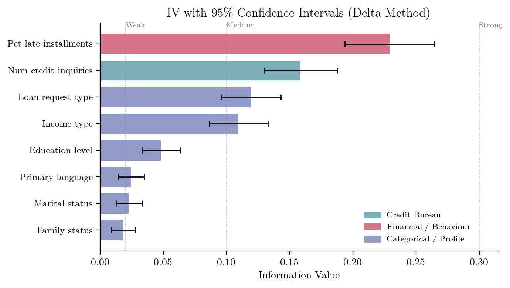
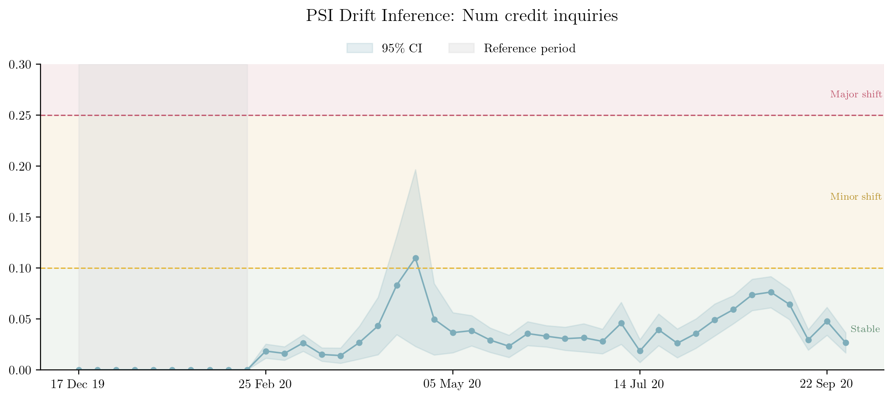
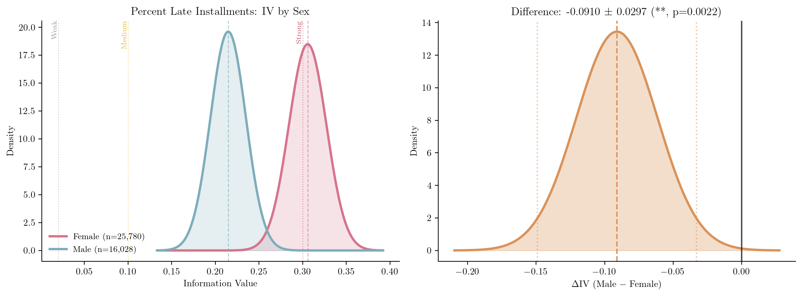

A credit risk data scientist is ranking features for a new scorecard. One variable has an Information Value (IV) of 0.12; another scores 0.15. A third feature's Population Stability Index (PSI) has just crept above the 0.10 line that the team treats as a warning threshold. Three numbers, three decisions: keep the 0.15 feature over the 0.12 one? Trigger a model review because PSI crossed the threshold?

In most credit teams these calls are made on the point estimates alone, as if each number were exact. But every one of them was computed from a finite sample, so each carries sampling noise. Is 0.15 *meaningfully* more predictive than 0.12, or could the order flip on next month's data? Did the population really drift, or did a quiet week thin the sample? Without a measure of uncertainty, there is no principled way to answer, and the data scientist is left trusting thresholds that were never derived from any statistical model.

It turns out the statistical model was there all along. WoE, IV, and PSI are not ad hoc credit-industry inventions; they are specific instances of a classical information divergence (a measure of how far apart two probability distributions are) with roots in Turing's wartime *weight of evidence* [@good1950probability] and Shannon's information theory [@shannon1948mathematical]. Recognising that connection is not just intellectual housekeeping. Because these metrics are functions of sample proportions, they have sampling distributions, and that lets us attach confidence intervals and probabilistic bounds to quantities the industry has long treated as fixed. This article shows how, organised around the three questions our data scientist is really asking.

## What these three metrics measure

Before the statistics, a plain-English refresher for readers who don't live in credit scoring:

- **Weight of Evidence (WoE)** measures, for a single bin of a feature, how differently "good" and "bad" borrowers are distributed: it is large and positive where bads concentrate, negative where goods do. Formally it is a log likelihood ratio, exactly the quantity Turing and Good called the *weight of evidence* [@good1950probability].
- **Information Value (IV)** rolls those bin-level signals into one number summarising a feature's overall discriminatory power. Practitioners rank candidate features by it and lean on conventional cut-offs (0.02 weak, 0.10 medium, 0.30 strong).
- **Population Stability Index (PSI)** uses the same arithmetic to compare a feature's distribution *today* against a reference period, and is the standard tool for monitoring drift after a model goes live.

The thing rarely taught alongside these formulas is that all three are the same underlying quantity.

## One identity: IV = PSI = Jeffreys divergence

The textbook IV formula, for a feature binned into $K$ categories with good- and bad-borrower proportions $p_{g,j}$ and $p_{b,j}$ [@siddiqi2017intelligent], turns out to be *exactly* the Jeffreys divergence (the symmetrised Kullback--Leibler divergence [@kullback1951information; @jeffreys1961theory]) between the good and bad distributions:

$$
\text{IV} = \sum_{j=1}^{K}(p_{b,j} - p_{g,j})\,\ln\frac{p_{b,j}}{p_{g,j}} \;=\; J(P_b \,\|\, P_g)
$$ {#eq-iv}

PSI is the same expression with a reference and a comparison distribution in place of bads and goods; a "fairness IV" is the same expression across two demographic groups. One formula, three uses.

::: {.column-margin}
**One formula, three applications.** IV, PSI, and fairness IV are all the Jeffreys divergence $J(P \| Q)$ applied to different partitions of the data.
:::

This is more than a notational coincidence. Every property of the Jeffreys divergence (non-negativity, symmetry, zero if and only if the two distributions match) transfers automatically to IV and PSI, grounding those decades-old thresholds in a well-understood statistical quantity [@kullback1951information]. More usefully for our data scientist, because the divergence is a function of sample proportions, it inherits a *sampling distribution*: it can be reported with a standard error. The derivation is short but notation-heavy, so we have boxed it below; the rest of the article only needs the result (**IV and PSI come with error bars**) and what that changes for each of the data scientist's three questions.

::: {.callout-note collapse="true" appearance="simple"}
## Technical note: where the standard errors come from

The standard error follows from a single observation: Weight of Evidence is a *centred* log-odds ratio,

$$
\text{WoE}_j = \underbrace{\ln\frac{n_{j,b}}{n_{j,g}}}_{\text{bin log-odds}} - \underbrace{\ln\frac{n_b}{n_g}}_{\text{population log-odds}} .
$$ {#eq-woe}

Reading this through Bayes' theorem in odds form gives the familiar updating rule: bin log-odds = population log-odds + WoE, so WoE is the evidence the bin contributes on top of the prior. In Bayesian terms, this is the logarithm of a Bayes factor. Subtracting the constant population term does not change the variance ($\text{Var}(X-c)=\text{Var}(X)$ for any constant $c$), so the standard error of WoE equals that of the bin log-odds ratio:

$$
\text{SE}(\text{WoE}_j) = \sqrt{\frac{1}{n_{j,g}} + \frac{1}{n_{j,b}}} .
$$ {#eq-se-woe}

This is the same $1/\sqrt{n_j\,p_j(1-p_j)}$ that appears as the standard error of a logistic-regression coefficient [@hand1997statistical]. Since IV is a weighted sum of WoE values, the delta method, a standard tool for propagating uncertainty through a function of estimates, applies (assuming approximate independence across bins):

$$
\text{SE}(\text{IV}) = \sqrt{\sum_{j=1}^{K}(p_{b,j} - p_{g,j})^2 \cdot \text{SE}(\text{WoE}_j)^2} .
$$ {#eq-se-iv}

Because IV = PSI = Jeffreys divergence, the identical formula gives a standard error for PSI whenever it is computed from binned counts. Full derivation in [@sudjianto2025information].
:::

## Question 1: Is this feature predictive?

With a standard error in hand, every IV point estimate becomes an interval, $\text{IV} \pm 1.96 \cdot \text{SE}(\text{IV})$. @fig-iv-ci shows this for eight Home Credit features. The error bars do the work the point estimates cannot: features with nearly identical IV can have widely different precision, so a feature scoring 0.15 may not be reliably ahead of one scoring 0.12 once their intervals overlap. Ranking on the point estimate alone can put the more uncertain feature on top by luck of the draw.

::: {#fig-iv-ci}
{fig-alt="Horizontal bar chart showing Information Value for 8 features with human-readable names, with 95% confidence interval error bars. Features are coloured by group: blue for Credit Bureau, pink for Financial/Behaviour, and purple for Categorical/Profile. Vertical dashed lines mark the conventional Weak (0.02), Medium (0.1), and Strong (0.3) IV thresholds."}

**Information Value with 95% confidence intervals for eight Home Credit features.** Notice that several features have overlapping intervals despite different point estimates: where the bars overlap, ranking one feature above another is not statistically justified, and the order may not survive the next data refresh. Colours indicate feature group: Credit Bureau (blue), Financial/Behaviour (pink), Categorical/Profile (purple).
:::

The standard error also suggests a quick check for whether a feature carries *any* signal: the ratio $Z = \text{IV}/\text{SE}(\text{IV})$ (a signal-to-noise ratio) flags how far the estimate sits from zero. Treat this as a screening heuristic, not a clean significance test. Binning choices, sparse bins, smoothing, dependence across bins, and the fact that we typically screen many features at once all distort the nominal error rate, so the number should not be read as a publishable p-value. Its value is in catching features whose apparent signal may be nothing more than sampling noise. That is a coarser check than comparing two features against each other, which is the job of the confidence intervals in @fig-iv-ci.

## Question 2: Has this population drifted?

Because PSI shares the formula, it shares the standard error, so the same trick distinguishes real drift from sampling noise. @fig-psi shows PSI computed weekly for the number of credit inquiries against a ten-week reference period, with confidence bands.

::: {#fig-psi}
{fig-alt="Line chart showing weekly PSI values for number of credit inquiries. A spike around April 2020 has a wide confidence band indicating low sample size. From May onward, PSI is persistently elevated with the confidence band above zero, indicating genuine drift. Coloured threshold zones mark stable (green), minor shift (orange), and major shift (red) regions."}

**Weekly PSI for number of credit inquiries, with 95% confidence bands.** The two movements to compare: the sharp April 2020 spike has a very wide band: it reflects a collapse in origination volume during lockdown (as few as 82 applications in a week), not a genuine shift. The quieter but *sustained* elevation from May onward keeps its band clear of zero, which is the signature of real drift. Without the bands, both look alike; with them, only the second warrants action.
:::

This is the practical pay-off for monitoring. A threshold crossing on its own is ambiguous: a thin week can push PSI over the line with no real change in behaviour, while a modest but persistent shift with a confidence band sitting clear of zero is the genuine article. The bands let a model-monitoring team triage alerts (chase the sustained signal, wait out the low-volume blip) instead of re-validating on every spike.

## Question 3: Does this feature behave differently across groups?

The third question reuses the same divergence a final way. Computed between two demographic groups rather than between goods and bads, the Jeffreys divergence measures how differently a feature is distributed across those groups, a "demographic IV". Plotting each feature's predictive IV against its demographic IV (@fig-pareto) lays out the performance--fairness trade-off in a single view.

::: {#fig-pareto}
{fig-alt="Scatter plot with Predictive IV on the x-axis and Demographic IV on the y-axis. Each point is a feature, coloured by group. Error bars show 95% confidence intervals on both axes. A horizontal dashed orange line marks a reference line at IV = 0.05."}

**Performance--fairness trade-off for eight features.** Read the plot by quadrant. The horizontal axis is predictive IV (against the default target); the vertical axis is demographic IV (against applicant sex). Features toward the **bottom-right** are the desirable ones: predictive yet evenly distributed across groups. Features toward the **top** carry a large demographic gap regardless of how predictive they are. The dashed line at 0.05 is a reference level for the discussion below, *not* a regulatory standard. Error bars are 95% confidence intervals on both axes; near the line, the bars show the classification can depend on the confidence level chosen.
:::

The most prominent outlier is `income_type`, with a demographic IV of 0.35. The reason is structural rather than prejudicial: retired pensioners are 29.7% of female applicants but only 15.0% of males, and salaried government employees are 31.3% of women versus 18.6% of men. The feature is picking up a genuine difference in employment composition, but a scorecard that uses it will treat men and women differently in proportion to that gap, which is exactly what the high demographic IV flags. Whether that is acceptable is a governance and legal judgement; the statistic only quantifies the size of the gap.

That distinction matters for how the number is used. No single demographic-IV value is in itself a compliance bar, and the uncertainty estimate does not turn a fairness question into an automated pass/fail. What it *does* offer is better governance evidence: a feature at $\text{IV}_{\text{fair}} = 0.048 \pm 0.001$ is in a different position from one at $0.048 \pm 0.020$, even though the point estimates match. A model-risk reviewer can weigh that uncertainty rather than treat the point estimate as exact.

The same machinery answers a sharper version of the question: do the groups differ not just in how a feature is distributed, but in how *predictive* it is? @fig-density computes IV separately for each group on shared bins. For percent of late installments, the feature is more predictive for women (IV = 0.31) than for men (IV = 0.21), a gap that is unlikely to be sampling noise. Tracing the full performance--fairness frontier, by mixed-integer programming, is developed in the paper [@sudjianto2025information]; the contribution here is the statistical one: making the trade-off quantitative rather than binary.

::: {#fig-density}
{fig-alt="Two-panel figure. Left panel shows two normal density curves for the IV of percent late installments, one for female applicants (pink, IV around 0.31) and one for male applicants (teal, IV around 0.21), with vertical dashed lines at the Weak, Medium, and Strong IV thresholds. Right panel shows the normal density of the IV difference (Male minus Female), centred at minus 0.09, with 95% confidence interval dotted lines and a vertical black line at zero."}

**IV by sex for percent of late installments.** Left: the IV sampling distributions for female and male applicants barely overlap. Right: the distribution of their difference sits clear of zero, so the feature is meaningfully more predictive for one group than the other, a differential that is invisible if IV is reported as a single number per feature.
:::

## What to do differently tomorrow

None of this requires new infrastructure, only reporting the uncertainty that was always implicit in the numbers. A short checklist:

1. **When ranking features by IV, report the confidence interval, not just the point estimate.** A feature at IV = 0.15 ± 0.04 may not be meaningfully ahead of one at 0.12 ± 0.03.
2. **Treat a PSI alert as a hypothesis, not a verdict.** Check whether the confidence band clears zero before you act: a thin origination week can lift the index over a line while the underlying distribution has barely moved.
3. **Bring the error bars to fairness reviews.** A demographic IV is one draw from a distribution: 0.048 ± 0.001 and 0.048 ± 0.020 should not weigh the same in a model-risk discussion, even though their point estimates are identical.
4. **Read the conventional cut-offs (0.02, 0.10, 0.30) as rules of thumb, not thresholds with the force of law.** The statistics size the question; they do not settle it.

## Code and data

All results are reproduced in a companion Jupyter notebook at [github.com/deburky/rwds-submission](https://github.com/deburky/rwds-submission). It uses the [Home Credit - Credit Risk Model Stability](https://huggingface.co/datasets/deburky/home-credit-credit-risk-model-stability) dataset [@homecredit2024] (522,596 loan applications, 8 features) and runs directly from HuggingFace. To keep the confidence intervals visible at the scale of the figures, the analysis uses a 10% sample stratified by week (roughly 52,000 applications, with every week retained); on the full dataset the intervals are correspondingly tighter. WoE encoding, IV, and standard errors use the open-source [FastWoe](https://github.com/xRiskLab/fastwoe) library.

## Conclusion

Weight of Evidence, Information Value, and the Population Stability Index are not ad hoc metrics. They are specific instances of the Jeffreys divergence, a quantity statisticians have understood since the 1940s. That single recognition is what gives the delta method something to work on, and the delta method is what supplies the standard errors, confidence intervals, and tests behind every figure above.

The shift it asks of practitioners is small but real: from reporting credit metrics as exact numbers to reporting them as estimates with uncertainty. That is a modest change in workflow, but it moves credit risk practice from point estimates to inference, which is, after all, what statistics is for.

::: {.article-btn}
[Back to Foundations & Frontiers](https://realworlddatascience.net/ideas/foundations-and-frontiers/)
:::

::: {.further-info}
::: grid
::: {.g-col-12 .g-col-md-12}
About the authors
: **Denis Burakov** leads data science and data engineering at Renmoney. He has held senior roles at Amazon, N26, KPMG, and Sberbank, spanning retail and corporate lending, regulatory and managerial risk models, and fraud detection. He is based in Berlin, Germany.

: **Agus Sudjianto** is SVP of Risk & Technology at H2O.ai and Executive in Residence at the Center for Trustworthy AI Through Model Risk Management, University of North Carolina Charlotte. He was formerly Head of Corporate Model Risk at Wells Fargo. He is a co-creator of PiML and MoDeVa.
:::
::: {.g-col-12 .g-col-md-6}
Copyright and licence
: &copy; 2026 Denis Burakov and Agus Sudjianto

 This article is licensed under a Creative Commons Attribution 4.0 (CC BY 4.0) <a href="http://creativecommons.org/licenses/by/4.0/?ref=chooser-v1" target="_blank" rel="license noopener noreferrer" style="display:inline-block;"> International licence</a>.

:::

::: {.g-col-12 .g-col-md-6}
How to cite
: Burakov, Denis, and Agus Sudjianto. 2026. "The Hidden Statistics Behind Credit Risk." Real World Data Science, June 2026. [URL](https://realworlddatascience.net)
:::
:::
:::

::: {.callout-note appearance="simple"}
**AI disclosure.** Claude (Anthropic) was used to assist with code development for the companion notebook and to help structure drafts of this article. All mathematical content, analysis, and editorial decisions are the authors' own.
:::
