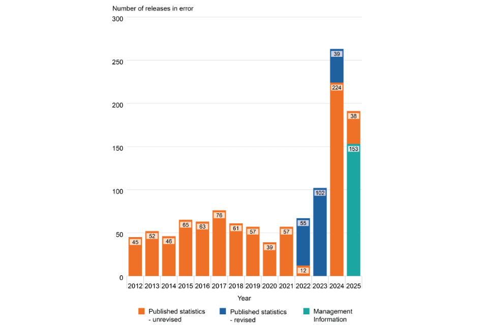

*Data Quality Under the Lens is a new Real World Data Science column. Each edition explores real-world moments where data quality shaped outcomes, sometimes driving failure, sometimes preventing it. From near misses to hard lessons learned, we look at what happens when data is up to the task... or falls short.* 

*If you spot a real world problem and think data quality could lie at the heart of the story, [send it in to the RWDS mailbox]((mailto:rwds@rss.org.uk)) and our Data Quality Detectives will analyse whether the Silent Drift, Proxy Trap, Spreadsheet Cascade, Governance Vacuum or Metric Mirage is responsible.*

## The Case of the Month 

On 15th  April  the UK government published the [Independent Review into Releases in Error](https://assets.publishing.service.gov.uk/media/69df4b6f642d5aaff4e04fbf/Independent_review_into_releases_in_error_-_redacted.pdf),  authored by Dame Lynne Owens (the former head of the National Crime Agency). Between  April 2025 and March 2026 179 prisoners were freed "in error" in England and Wales, according to the Ministry of Justice. Some of these releases resulted from misplaced warrants for imprisonment or remand, sentence miscalculations, or the result of mistakes by courts or other authorities, but most were due, essentially, to poor data quality.

The consequences – individuals released into the community earlier than intended – highlight the potential public safety implications of data quality. 

## What Actually Happened? 
In the last few years there has been a sharp increase in the number of prisoners released in error. 

These include:

- A convicted sex offender, whose release, caused by paper notes being misinterpreted by poorly trained staff, led to the government’s independent report.
- A high-profile fraudster released due to the court incorrectly recording his 45-month jail term as a suspended sentence.
- A man who had committed serious violent offences and robbery, released due to a clerk failing to properly aggregate multiple sentences.

Although it appears that there has been a downturn in error since the peak of 2024, the report acknowledges that “some releases in error incidents are only identified when a prisoner returns to custody at a later date. Consequently, figures for more recent years may increase over time.” In her report, Dame Lynn states “The fact that the Department’s understanding of the true extent of releases in error is the minimum of what is likely to be the case was not my only point of alarm. The immediate concern I had was that the Ministry of Justice and HMPPS seemed to explicitly accept that the data is not representative of the ‘true’ picture of releases in error and yet had no means by which they were regularly quantifying the level of inaccuracy and therefore the level of extant risk of harm to the public. Without an established level of ‘accepted’ inaccuracy and risk, nor a regular means by which to check this, my concern thus became that the Government has historically and ongoingly accepted an outstanding and unquantifiable risk to the public.”
In short, the crisis was two-fold: not only were dangerous prisoners being released in error, but the data intended to track these failures was so fundamentally flawed that the true risk to public safety remained hidden and unquantifiable

## Disaster or Near-Miss? 
Some of the prisoners who were released in error handed themselves back in. But, in some cases, the error of their release was only identified as a result of their committing a new offence. There are likely more unlawfully released prisoners that we don’t yet know about.

## Why This Matters Now 
This case reveals failures at two levels. At the operational level,low staffing,  inadequate training and  poor morale, within what has been described as a “highly challenging operational environment,” are leading to errors in how information is recorded or interpreted. At the systemic  level, there is insufficient visibility into how and when these failures occur. Together, these issues show that a digital-first strategy cannot succeed on a foundation of "fragmented information”. Without skilled human oversight to verify facts, there is a risk that systemic problems will be automated rather than resolved. 

## The Practitioner Takeaways 
The report highlights understaffing and low morale as key contributors to failure, yet the government’s response – only £8m in funds allocated for additional staff, but £82m allocated for a digital overhaul – prioritises digital investment over workforce capacity. That imbalance matters: if previous moves toward computerisation have coincided with declining system integrity, it suggests the issue is not simply tooling, but the capacity of people to manage and validate the data those tools depend on.

For practitioners, there are some clear takeaways to avert similar disasters: 

- Don’t just track outputs; measure uncertainty—missing data, overrides, corrections, and inconsistencies. If you can’t see where errors arise, you can’t manage them.
- Design for verification, not just speed. Build checkpoints that prevent unvalidated data from flowing downstream.
- Ensure staff have the time and training to exercise judgement, not just act as a procedural step.
- Regularly trace records back to their origin, especially where legacy or paper systems are involved.
- Make data quality visible. Surface error rates and data gaps alongside performance metrics so trade-offs are explicit.

## The Data Quality Pattern
This case is an example of what we at Real World Data Science refer to as a **Metric Mirage**. Leadership accept and rely on data they know is unrepresentative because they have no means of quantifying the true scale of failure. This happens when fragmented, often paper-based,  records are treated as reliable digital data without being properly verified. As systems become more complex, human judgement and professional curiosity are increasingly displaced by the pursuit of speed and automation. This doesn't fix the underlying errors; it simply hides them, allowing a Silent Drift in accuracy to continue unchecked until a high-profile tragedy forces a review.

## Our prisons remain in crisis, and there is no quick fix. 
It is therefore right that the government has accepted Dame Lynne’s findings and is moving swiftly to strengthen training, support and oversight for frontline staff. But lasting progress will depend on whether prisons are given sufficient, experienced staff with the time, tools and confidence to calculate sentences accurately. New systems and simpler rules will help but, when there is underinvestment in the people responsible for data quality, no amount of digital transformation will fix the problem— failures will simply be scaled more efficiently.

::: {.further-info}
::: grid

::: {.g-col-12 .g-col-md-12}
About the author:
: **A. Rosemary Tate** is a Chartered Biostatistician and Computer Scientist with over 30 years of experience in medical research and statistical consulting. She has a BSC in mathematics and a DPhil in Computer Science and AI, and an MSc in Medical Statistics. She has been scientific manager of a large EU-funded project and held lectureships at the Institutes of Child Health and Psychiatry. An independent statistical consultant since 2016, she now spends most of her time as a “Data Quality Agent Provocateur”.

::: {.g-col-12 .g-col-md-6}
**Copyright and licence** : © 2026 A. Rosemary Tate  

This article is licensed under a Creative Commons Attribution 4.0 (CC BY 4.0)
<a href="http://creativecommons.org/licenses/by/4.0/?ref=chooser-v1" target="_blank" rel="license noopener noreferrer" style="display:inline-block;">International licence</a>.
:::

::: {.g-col-12 .g-col-md-6}
**How to cite** :  
Tate, A. Rosemary 2026. “**Data Quality Under the Lens: UK Prison Release Errors**” *Real World Data Science*, 2026. [URL](https://realworlddatascience.net/the-pulse/posts/2026/05/rwds-big-questions-challenges-today.html)
:::

:::
:::

