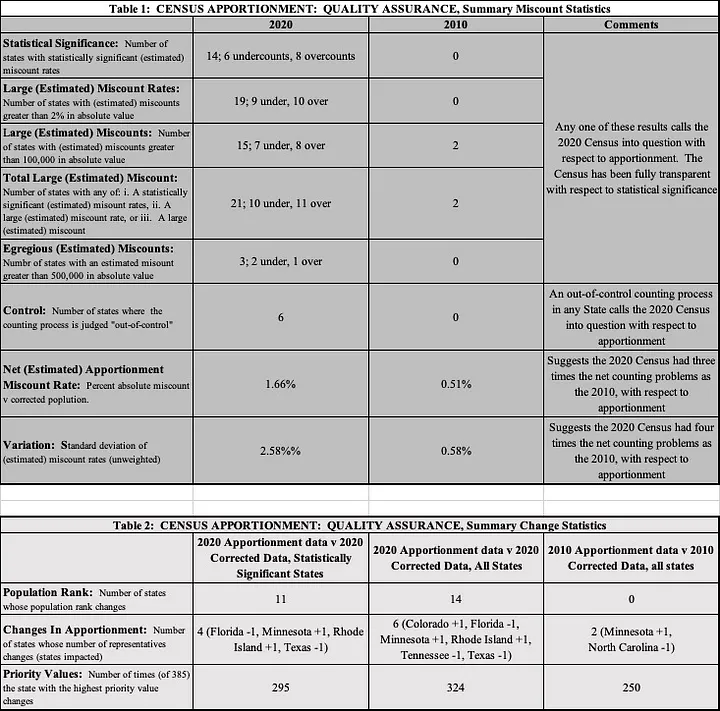
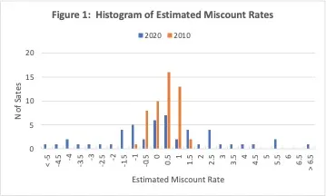

*Data Quality Under the Lens is a new Real World Data Science column. Each edition explores real-world moments where data quality shaped outcomes, sometimes driving failure, sometimes preventing it. From near misses to hard lessons learned, we look at what happens when data is up to the task... or falls short.* 

*If you spot a real world problem and think data quality could lie at the heart of the story, [send it in to the RWDS mailbox]((mailto:rwds@rss.org.uk)) and our Data Quality Detectives will analyse whether the Silent Drift, Proxy Trap, Spreadsheet Cascade, Governance Vacuum or Metric Mirage is responsible.*

## The Case of the Month 
In a press release dated March 10, 2022, Census Director Robert Santos stated: “Taking today’s findings as a whole, we believe the 2020 census data are fit for many uses in decision-making as well as for painting a vivid portrait of our nation’s people.”
The “fit for many uses” clause leads to several questions: for what uses is the census fit? For what purposes is it not? And, perhaps most importantly, was it fit for apportionment of representatives for elections in the United States?

[Apportionment is the critically important task of allocating congressional representatives to the fifty states.](https://www.census.gov/topics/public-sector/congressional-apportionment/about.html) For apportionment, with its high political consequences, we expect the census to:

1. Ensure that each state is assigned the right number of representatives; and
2. Provide a measure of comfort that the results can be trusted.

These criteria constitute a high bar. But the stakes are high, fully justifying the expectations.

In 2022, [we performed an independent review](https://tomredman.medium.com/is-the-2020-census-fit-for-apportionment-3467e54b4670) using data available on the Census Bureau website to address the question of fitness-for-apportionment. Our review raised serious concerns about the fitness of the 2020 census for apportionment. In particular, six states appeared to have been assigned the wrong numbers of representatives.

While the events examined here relate to the 2020 US Census, the underlying issue is much broader. This is fundamentally a quality assurance (QA) case, concerning how decision-makers can know that data are fit for their most important intended use. Whether the setting is government, healthcare, finance, research or business, the same challenge applies: data may be useful for many purposes yet still fall short where the stakes are highest. 

## What Actually Happened? 
We collected relevant data from census.gov, including apportionment data—the population count used for apportionment—and estimated miscount rates based on a Census-conducted Post Enumeration Survey (PES).

While the apportionment state populations are counts, performed according to the US Constitution and Census regulations, the PES is a statistically based survey used to evaluate the accuracy of the apportionment count. One hopes that the resulting estimates of miscount rates are small.

There were statistically significant miscounts in fourteen states, and even one should give pause. Fourteen is of enormous concern, especially when compared to zero statistically significant miscounts in 2010.

Importantly, six states—Colorado, Minnesota, Rhode Island, Florida, Texas and Tennessee—receive different numbers of representatives when the estimated corrections are taken into account, i.e. when using the PES population instead of the apportionment population.

There were twenty-one states with large miscounts, with ten states having large undercounts and eleven large overcounts.

Conducting a census is difficult (try simply counting your socks!) and the pandemic added enormous challenges. One should expect problems. Further, as we’ve already noted, the census is used for many purposes. But none of this means that the central issue for representative democracy can be overlooked. 

Had each state simply been over- or undercounted by a similar proportion, apportionment issues would likely have been minor. But the state-to-state variation is large, especially compared to the 2010 census. In 2010, estimated miscount rates were tightly clustered near zero, while for 2020 they were much more dispersed, which is especially clear looking at the below chart:

Ultimately, the high state-to-state variation and high miscount rates led to the different numbers of representatives officially apportioned and those projected using PES estimated state populations.

## Disaster or Near-Miss? 
Quality assurance (QA) asks a deceptively simple question: did the overall effort provide the required quality? Our two fitness-for-apportionment criteria represent a high bar, but in our view the pandemic does not justify relaxing them.

One cannot easily escape our main conclusion: the 2020 Census is not fit-for-apportionment. It appears to fail criterion one—assigning the correct number of representatives to each state—and it most certainly fails criterion two—providing confidence in the results.

The case therefore raises an important question. What safeguards might have prevented or contained the issue before apportionment occurred?

## Why This Matters Now 
Perhaps more than anyone, we appreciate the leadership, management and operational challenges associated with data quality. Interestingly, [the UK also experienced serious problems](https://rss.onlinelibrary.wiley.com/doi/full/10.1111/1740-9713.01662) conducting its 2021 census, and so, frankly, we’re surprised this topic hasn’t generated far more discussion. 

The key issue raised by this case is embedded in the Census Director’s statement itself. Data may be “fit for many uses” and yet still not be fit for its most important purpose.
That distinction matters in an era of growing reliance on analytics, AI and automated decision-making. The question is not whether data are generally useful. The question is whether they provide the required quality for the decision at hand.

The relevance of the discussion surrounding the Census extends far beyond population counting. National statistics, resource allocation, and research on all kinds of topics all rely on census data for high-consequence decisions, and people expect confidence that the data are fit for their intended use.

## The Practitioner Takeaways 
Of course, those running the Census should do all they can to “get it right the first time.”  This means clarifying the most important uses, setting quality standards, carefully defining key terms, defining counting processes, managing and controlling them well, and making improvements in response to unexpected new circumstances.  

The larger goal, however, is “getting it right” and that’s where QA comes in. A pertinent and timely analogy can be made to the introduction of video assistant referees (VAR). Over the last several years, football (or soccer, to Americans) has introduced VAR as a means to provide real-time QA for referees’ decisions. While purists may object that it disrupts the flow of the game, there is little question that it helps get more calls right!  After all, even the best-trained and best-rated officiating crews make mistakes.   

The implication is clear: If it really matters, you must build an overall quality system that embraces both doing all you can to get it right the first time and effective QA.  

## The Data Quality Pattern: The Leadership Vaccum
The Leadership Vacuum occurs when the quality system is not up to snuff (that is, efforts to get it right the first time and/or effective QA are missing).  In this case the Post Enumeration Survey showed that the first element failed. And the PES itself did not lead to correct apportionment. As we’ve described, the result is a gap between actual and required levels of quality. Exacerbating this, when responsibility for resolving such a gap is unclear, confidence in outcomes is sure to suffer. 

Despite the clear challenges that come with creating a census, especially in a pandemic, the bar for apportionment is necessarily a difficult one to clear. The stakes are high, fully justifying the expectations. The enduring lesson is that demanding requirements call for powerful, comprehensive quality programs.  

Note: This article has been adapted, expanded and updated alongside the authors from: [“Hoerl, R. and Redman, T.C. “Is the 2020 Census “Fit-for-apportionment”?](https://tomredman.medium.com/is-the-2020-census-fit-for-apportionment-3467e54b4670) Medium, 24 August 2022. All figures are taken from that article. 

::: {.further-info}
::: grid

::: {.g-col-12 .g-col-md-12}

::: {.g-col-12 .g-col-md-6}
**Copyright and licence** : © 2026 Tom Redman, Roger Hoerl and Hannah de Mowbray 

This article is licensed under a Creative Commons Attribution 4.0 (CC BY 4.0)
<a href="http://creativecommons.org/licenses/by/4.0/?ref=chooser-v1" target="_blank" rel="license noopener noreferrer" style="display:inline-block;">International licence</a>.
:::

::: {.g-col-12 .g-col-md-6}
**How to cite** :  
Redman, Hoerl and de Mowbray 2026. “**Data Quality Under the Lens: Was the 2020 US Census “fit-for-apportionment”?**, 2026. [URL](https://realworlddatascience.net/the-pulse/posts/2026/07/31/DQUL_July.html)
:::

:::
:::
:::

