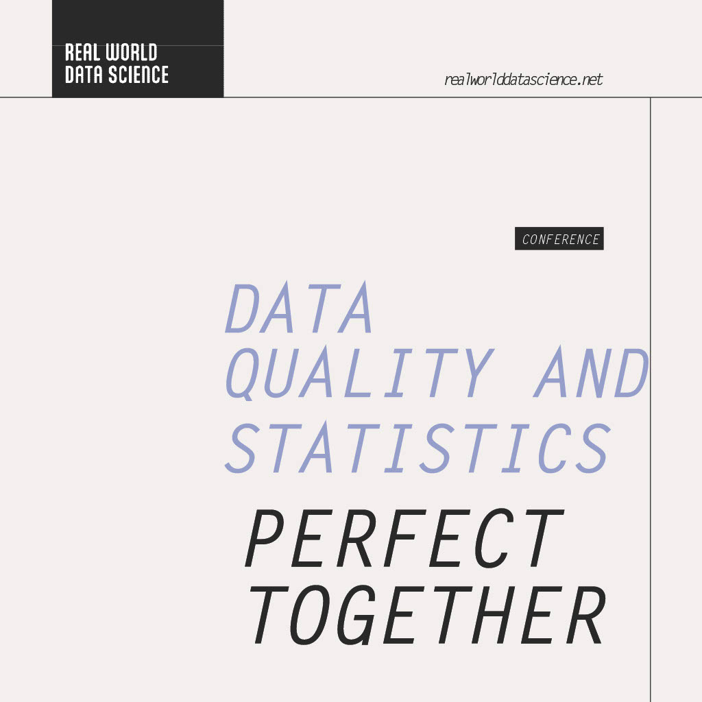

Breathe new life. Seize the opportunity.

As organisations increasingly adopt AI, the quality of the data underpinning their systems and decisions is coming under greater scrutiny. While many organisations recognise that they have a serious data quality problem, moving beyond short-term “data cleaning” to address the underlying issues can be challenging.

This provides an enormous opportunity for practicing and research statisticians. After 
all, many of our approaches and tools can help find and eliminate sources of error, 
evaluate whether a collection of data is fit-for-use in addressing the problem at hand, 
and quantify results. 

A one-day conference in Edinburgh on 22 October 2026 will bring together practitioners and researchers interested in seizing this opportunity and building a community around data quality.

The conference is being organised jointly by the [RSS Edinburgh Local Group](https://rss.org.uk/edinburgh/), the [RSS AI Task Force](https://rss.org.uk/policy-campaigns/policy-groups/ai-task-force/) and the [RSS Medical Section](https://rss.org.uk/membership/rss-groups-and-committees/sections/medical/), and will be held at the [Bayes Centre](https://bayes-centre.ed.ac.uk/).

## What to expect

● Case studies that illustrate the opportunity
● Discussions of open research and practical topics and gaps in the current 
literature
● Workshops to help individuals & groups spot opportunities for themselves
● Networking opportunities to interact with others passionate about data quality

## Keynote Speakers 

The conference will feature keynote speakers Tom Redman, President of Data Quality Solutions, and Roger Hoerl, Professor of Statistics at Union College. Both are prominent authors on data quality, with work spanning the statistical and business literature, including Harvard Business Review and Sloan Management Review. They are also [Real World Data Science columnists](https://realworlddatascience.net/the-pulse/posts/2026/07/31/DQUL_July.html).

## Call for abstracts. 

Selected papers from the conference will be published in Real World Data Science, providing an opportunity to share practical insights and research with the RWDS community.

The Bayes Centre has a maximum capacity of 50 participants, so those interested in attending are encouraged to get in touch with the organisers as soon as possible.

To submit an abstract or enquire about attending, contact Rosemary Tate at [rosemarytate@gmail.com](mailto:rosemarytate@gmail.com).

Conference date: 22 October 2026
Location: Bayes Centre, Edinburgh
Abstract deadline: 22 September 2026
 

::: {.further-info}
::: grid
::: {.g-col-12 .g-col-md-6}
Copyright and licence
: &copy; 2026 Royal Statistical Society

 This article is licensed under a Creative Commons Attribution 4.0 (CC BY 4.0) <a href="http://creativecommons.org/licenses/by/4.0/?ref=chooser-v1" target="_blank" rel="license noopener noreferrer" style="display:inline-block;"> International licence</a>. Thumbnail photo by <a href="https://unsplash.com/@johnsonvr?utm_content=creditCopyText&utm_medium=referral&utm_source=unsplash">Virgina Johnson</a> on <a href="https://unsplash.com/photos/turned-on-red-open-neon-sigange-QmNnZj_Ok-M?utm_content=creditCopyText&utm_medium=referral&utm_source=unsplash">Unsplash</a>.

:::
::: {.g-col-12 .g-col-md-6}
:::
:::
:::