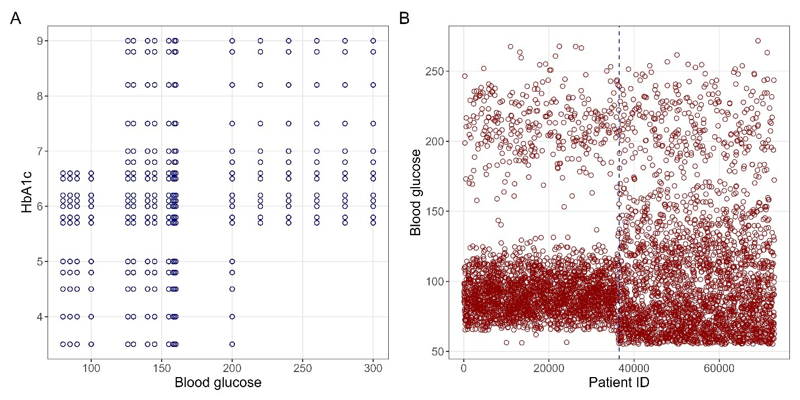

*Data Quality Under the Lens is a new Real World Data Science column. Each edition explores real-world moments where data quality shaped outcomes, sometimes driving failure, sometimes preventing it. From near misses to hard lessons learned, we look at what happens when data is up to the task... or falls short.* 

*If you spot a real world problem and think data quality could lie at the heart of the story, [send it in to the RWDS mailbox]((mailto:rwds@rss.org.uk)) and our Data Quality Detectives will analyse whether the Silent Drift, Proxy Trap, Spreadsheet Cascade, Governance Vacuum or Metric Mirage is responsible.*

## The Case of the Month 
The unique thing about clinical prediction models is that they aim to directly improve patient care by providing clinicians with personalised information. Yet they can also be treated as public health tools when applied through policy or guidelines. There is no question that these tools should be developed, validated and implemented with rigorous evidence and appropriate standards. However, a recent study identified 125 published articles for clinical prediction models that were developed with unreliable and potentially fabricated data (1). Articles using two datasets for stroke and diabetes were cited nearly 1,800 times, including in 86 review articles and a medical device patent. Three of the articles had evidence they were potentially used on patients. 

We are seeing a boom in prediction model research due to interest in AI and the promise of personalised prediction, but AI also provides an easy way to generate data and papers. One place an individual may find data is on the website, self-proclaimed as the “world’s AI proving ground”, Kaggle, which hosts more than 700,000 datasets. Users can freely upload almost any data and receive community incentives such as followers, achievements, medals and rankings. These rewards may spur the uploading of synthetic or unreliable data. 

Data provenance, the who, what, when, where, why and how of data is now more important than ever. Trust in the source and quality of data is imperative for developing predictions that aim to directly influence individual health and be applied to populations. 

## What Actually Happened? 
The two Kaggle datasets mentioned here were meant to represent data collected from diabetes and stroke patients. Unfortunately, Kaggle does not require data provenance to be supplied with any dataset, and no information was declared for where these data came from. After investigating the two datasets and assessing them against the international TRIPOD+AI reporting guidelines, no information was found to authenticate either dataset. An important piece of information — whether these supposed patients had haemorrhagic or ischemic strokes and type I or type II diabetes — was not disclosed.  

Upon further inspection of the data, patterns appeared which were consistent with fabricated data. For example, the diabetes dataset had a perfect 100,000 patient observations and both HbA1c and blood glucose (important markers of diabetes) had 18 discrete values forming odd, organised patterns (Figure 1). The stroke datasets saw an unexpected and unexplained for shift in the blood glucose distribution at half the maximum patient ID. It also contained 5,110 unique patients, but 72,940 patient IDs were supplied in the dataset, indicating 67,830 patients (if real) were missing and unaccounted for (Figure 1).

**Figure 1**

Figure 1. Plot A is from the diabetes dataset showing the association between the HbA1c and blood glucose values for 100,000 individuals. Plot .B is from the stroke dataset showing an unexplained change in the distribution of blood glucose values at half the maximum patient ID for 5,110 individuals. Figure adapted from (1) 

Issues with these data had been flagged on the Kaggle discussion pages but were dismissed by researchers who declared its use in research as evidence of authenticity: 

*“These datasets are frequently referenced in machine-learning literature and educational resources for developing and evaluating predictive models. They contain structured health-related attributes commonly used in disease prediction research.”* (2)

## Disaster or Near-Miss? 
Three articles indicated they had used predictions on patients or were going to deploy the model in a local clinic, one article had even been referenced in a medical device patent. While it was not verified if patients were treated based on the predictions, it is nevertheless incredibly worrying. Further, 86 review articles cited one or more of these prediction model articles, indicating they are being passed off in the literature as legitimate. There is no place for medical treatments to be influenced by data that is not fit for purpose. 

Only published articles were examined and identification of these articles relied on the authors referencing the Kaggle webpage. More than 600 outputs were identified using these datasets which included books, theses, preprints and conference proceedings. Thus, what was examined is a minimum representation to the extent of this problem, identified from only two datasets. It is very unlikely this is an isolated event, and more datasets and articles are likely being developed or used on patients.  

## Why This Matters Now 
As we move into an era of prediction fuelled by AI, it is more important than ever that data is of sufficient quality. Patient and practitioner facing prediction tools are abundant and must produce predictions that can be trusted to be accurate and lead to improved outcomes. However, regulatory advancements are slow moving. Another recent study examining implementation of prediction models into guideline documents showed only 8 out of 84 guidelines mentioned guidance for prediction models and none of them were comprehensive (3). Not only is there a lack of guidance on implementation, but these tools may not perform as expected. An editorial prompting more oversight of these tools saw 81% performed worse on external data and 43% were recalled within the first 12 months (4). Additionally, from 1,357 FDA examined AI tools, only three examined patient outcomes (5). 

## The Practitioner Takeaways 
The inundation of prediction models and unreliable data leaves us wondering what to trust. What will work? And which data is safe for use? Simply put, we can answer these questions by bringing this back to the fundamental underpinning of science and modern medicine: evidence. 

Predictions need to provide evidence that they will improve outcomes. Like drugs, predictions will vary in their efficacy across patients and populations, and we need to follow these tools over the course of their use. Ideally, cluster randomized trials (like drug trials) will provide us with evidence of efficacy. However, retrospective validation studies can be sufficient for implementation into practice, but these paper-based performance metrics are not typically replicated in the real world. We need more evidence both that they do not cause harm and that they do improve outcomes. If it sounds too good to be true, it may just be.   

## The Data Quality Pattern: The Proxy Trap or The Governance Vacuum?
Two defined issues emerged from these findings. There exists a Proxy Trap where credibility and authenticity was given to datasets because they were used in previous research and are extremely popular. Decision making for the use of data was offloaded to other individuals and assumed to be correct. Yet, no processes for the verification of data and its provenance could be shown leading to a Governance Vacuum, further allowing unreliable data to be treated as authentic. Not only did the repository not require data provenance, but the journals did not either. No individual or institution took sole responsibility for the quality of data. The repository relied on individuals to report data, the individuals relied on journals as a sign of reliability, and journals relied on individuals to be correct, yet none of them were.  

Six layers of humans in the research ecosystem failed. The repository, the uploading dataset users, the researchers, the peer-reviewers, the journal editors and review article authors did not require or check data provenance. Roughly 500 researchers, 250 peer-reviewers, 125 editorial decisions, not one of whom stopped to check the reliability or authenticity of the data. Such severe and potentially harmful outcomes could have just as easily been avoided by mandating simple reporting of who, what, when, where, why and how the data were collected. Trust in the source of data is more important than ever in an age where data creation is so easily met at our fingertips. Patients and practitioners deserve transparency to trust the systems they use. 

 

## References 

1. https://doi.org/10.1186/s12916-026-04981-y  

2. https://pubpeer.com/publications/64738FD54017B4FCDB292A6483FDD0 

3. https://ebm.bmj.com/content/early/2026/05/28/bmjebm-2025-114164 

4. 10.1056/AIe2600807  

5. https://doi.org/10.1371/journal.pdig.0001597 

::: {.further-info}
::: grid

::: {.g-col-12 .g-col-md-12}
About the author:
: [**Alexander Gibson**](https://www.linkedin.com/in/alex-d-gibson/) is PhD student at the Queensland University of Technology with the [Australian Centre for Health Services Innovations](https://www.aushsi.org.au/). His PhD work focuses on examining statistical practices in clinical prediction models and good research practices being awarded a research training program scholarship. His PhD thesis is entitled “On examining poor statistical practices in published clinical prediction models”.

::: {.g-col-12 .g-col-md-6}
**Copyright and licence** : © 2026 Alexander Gibson 

This article is licensed under a Creative Commons Attribution 4.0 (CC BY 4.0)
<a href="http://creativecommons.org/licenses/by/4.0/?ref=chooser-v1" target="_blank" rel="license noopener noreferrer" style="display:inline-block;">International licence</a>.
:::

::: {.g-col-12 .g-col-md-6}
**How to cite** :  
Alexander Gibson 2026. “**Data Quality Under the Lens: Should clinical decisions be influenced by unknown public datasets?”**, 2026. [URL](https://realworlddatascience.net/the-pulse/posts/2026/08/28/DQUL_Aug.html)
:::

:::
:::
:::

